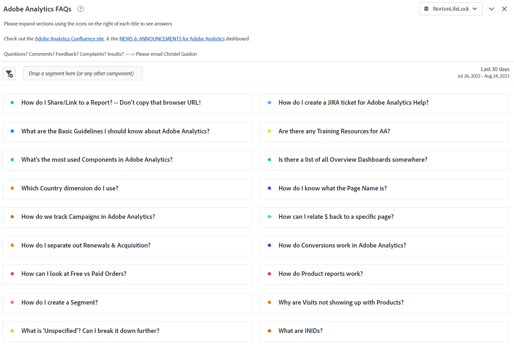
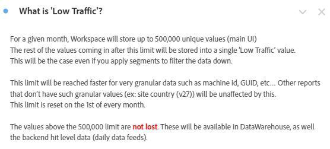
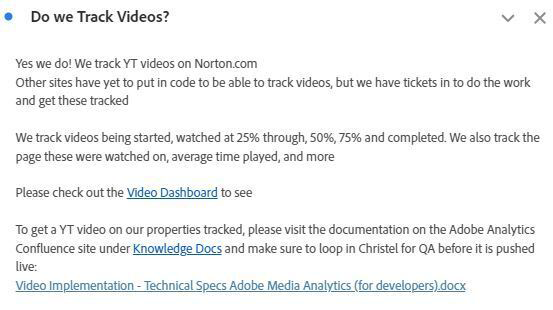
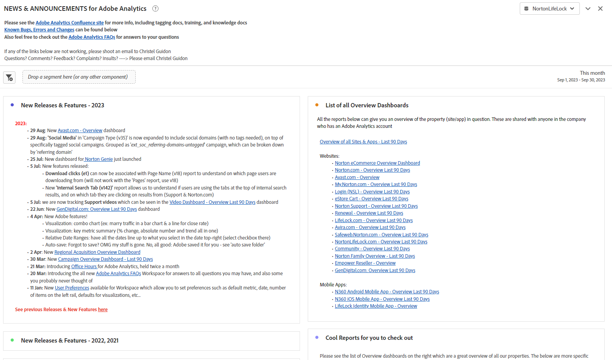
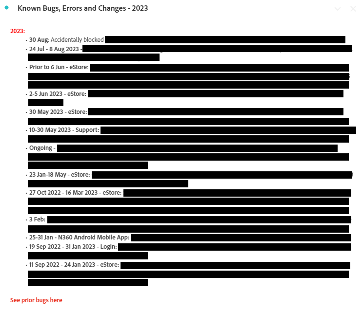

# Creating Operational Dashboards within Analysis Workspace

_Explore how operational dashboards in Adobe Analytics Workspace revolutionize communication and efficiency. Discover how to create FAQs, News & Announcements, and Bugs & Features dashboards for streamlined information, improved user experience, and enhanced engagement._

Like a lot of admins, I run an internal info hub (Confluence or similar) for Adobe Analytics. Over time, I got sick of answering the same questions on repeat and needed a smoother way to reach my users without feeling like I was pinging and annoying them all the time. I needed repositories for info that was less static.

I noticed users often ignored my referrals to the Confluence site, with reasons like "My VPN is off," or "I can't read it now," etc. Basically, "I'll read that doc later" means that it will never get read, and the same question will be asked again next week. 

***The realization hit:** Workspace's versatility could be a game-changer. Users prefer quick, direct answers within Workspace, so let's keep them there-avoid extra steps.*

I went ahead and created operational dashboards to share company wide. So far, they have kept users informed, centralized info, and cut down on frustration. This has been an easy, evolving process that boosts efficiency over time.

People have been able to get a lot of good info without me, understand areas of the site, see how cool Adobe Analytics is, and (important for me 😊) ask me fewer questions and take less of my time. 

**I highly recommend that you create dashboards for all your properties or main areas of your site.** They should give an overview of the property/site/app/flow and have basic information and quick insights. They should be shared with the whole company, allowing all users to get an understanding of the property without any handholding. For me, these dashboards usually answer 80% of the questions I get and save me valuable time.

None of this stops you from keeping your Confluence site, which remains very useful to have. I even reference it at the top of each operational dashboard. But I love shortcuts – both for me and for my users.

Let me walk you through the three operational dashboards I created for my company, GenDigital, that helped me to reach these goals.

1. FAQs
1. News & Announcements
1. Bugs, Features and Major Releases Log

## 1 - FAQ dashboard

Tired of the endless loop of repeating answers? Stop! Save time by crafting an FAQ dashboard. Users can consult it before asking, or you can quickly link to it in your responses.

Just create [text visualizations](https://experienceleague.adobe.com/docs/analytics/analyze/analysis-workspace/visualizations/text.html) with questions formatted as titles and answers/explanations as content, all collapsed to show just the question. Group them by relevance (e.g., pages or products) or use panels. Keep it simple, prioritizing common queries at the top.

Instead of writing long emails or rediscovering old explanations, update your FAQ dashboard. Start now and expand over time. Use hyperlinks to reference other dashboards or related FAQs within reports. Provide complex context when needed by linking from other dashboards to FAQs.

For Gen Digital, our FAQs focus on customized Adobe Analytics use, not basics. Email specific FAQ links by right-clicking, selecting 'get visualization link,' and sharing the vanity URL. This highlights the exact content for users. Use freeform tables for data illustration, adding more explanations with 'edit description.'

Once your FAQs feel comprehensive, share them with the company for collective access and learning. Keep enhancing as needed.

Here are some screenshots of what an FAQ dashboard can look like:

 

## 2 - News and announcements dashboard

Another useful operational dashboard is a news & announcements dashboard. I started this one because I wanted to get info out to my users, but I felt like I was pinging and annoying them instead. Does everybody need this update? Which users? Power users only? Should I send out a weekly newsletter nobody will read? By having the update directly in Workspace instead, users can see it as soon as they login, and I don't need to send out yet another company email that nobody wants to read. 

Since these dashboards are seen company-wide, updates rise to the top immediately. Here is the type of info I include in the news & announcements dashboard:

- Feature releases and updates on our side (mainly code releases)
- Important new features from Adobe
- Office Hours schedule
- List of all Overview Dashboards & Cool Reports to Check Out

It covers our new functionalities, tracking, and vital dashboards. Hyperlinks in text reports (or atop other reports via right-click & edit description) let you link to other dashboards in Adobe Analytics or Adobe's feature release page.

Here is what my News and Announcement dashboard looks like: 

## 3 - Bugs, features and major releases log

The goal of this operational dashboard is to have a central place to put all the bugs and errors. I used to manage this in Excel, but it was cumbersome and tough to share. Why not put it directly in Workspace?

You could integrate it into the News & Announcements dashboard if you want it to be less prominent. However, if bug reporting is substantial or critical to your company, a separate dashboard might be wise.

I use a text visualization and keep it very simple with bullet points. The bullet point is prefixed with the date of the bug, as well as the property (ex: '3jan23-17jan23 - Norton.com', 'Prior to 14sep22 - Chat'). I then add the details and try to keep it short and concise. I avoid indicating which team was at fault and avoid adding too many technical details your users probably don't care about. 

The most recent bug is at the top, while older ones are in yearly text reports (e.g., '2022 - Known bugs, errors, and changes') - all collapsed.

Nothing fancy. Really easy to do, and you must admit, a whole lot better than that Excel file you keep on your hard drive and keep updating on Confluence. 

I also reference Overview dashboards & Cool Reports here, similar to other operational dashboards. Links to FAQs and news & announcements dashboards are towards the top. 

Here is an example of what your log can look like: 

Creating operational dashboards in Adobe Analytics Workspace has been a game-changer for me. Like many admins, I managed an internal hub and struggled with duplication of answers and effective user communication. The need for dynamic repositories led to the realization that Workspace's versatility could revolutionize engagement. I hope you embrace the power of operational dashboards in Adobe Analytics Workspace. Enhance your users' experience, save time, and enjoy a more organized environment. Your journey begins now, and these dashboards are your keys to efficiency and user-friendliness.

## Author

This document was written by:

**Christel Guidon**, Digital Analytics Platform Manager at Gen

Adobe Analytics Champion
