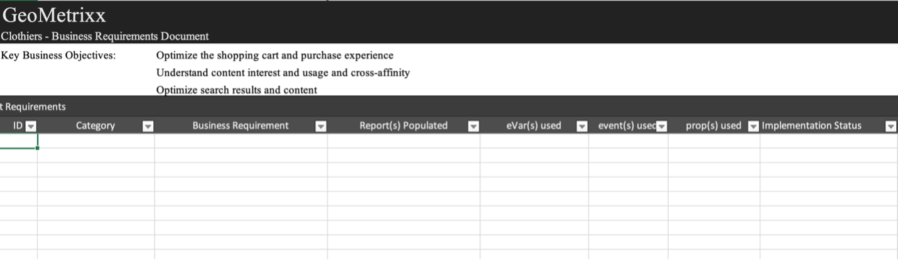
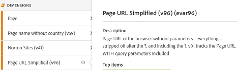
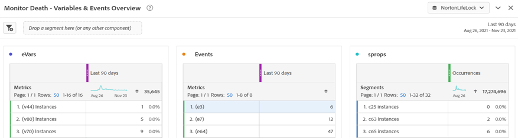

# Download the [!DNL Adobe] [!DNL Analytics] implementation playbook

Before getting started, [download the playbook](assets/aa-implementation-playbook.xlsx).

## Business Requirements tab

**WHAT:** A Business Requirements Doc (commonly referred to as BRD) is a very important piece of documentation that key stakeholders, business users and tech users will want to collaborate on. It is a place for documenting all of your desired KPIs, reporting requirements, and any data point you wish to see when your [!DNL Adobe] [!DNL Analytics] (AA) implementation is complete.

**WHY:** This serves as a jumping off point for the documentation that follows (SDR, tech spec, etc.) and is a common source of truth for an agreed upon end state of AA. This document organizes thoughts across teams within the org to form one guiding direction to move forward with building out or enhancing your implementation.

**HOW:** Documenting the business requirements is commonly done by the end business users of AA, but it is important to get feedback from tech users as there can be technical challenges to note and certain data points may require more effort than others, which factors into prioritization.

Ask yourself, "what are the things we want to track on our site", "what data points will be important to me in reporting use", and most importantly, "how will these data points inform decisions". It is important to ensure each of your business requirements relates to a data point that can be used to inform business decisions. For instance, it can be tempting to want to track every click on your site, but at the end of the day, what insights are you gleaning from that reporting?

Start by filling in column C in the screenshot below (Business Requirement). This should be something like "How many internal searches are completed on our site" or "Which internal campaign spot is most effective in terms of impressions". After filling in this level of detail, you can go back and fill in column B (Category) and group the requirements into categories like "Search" or "Internal Promo" which should correspond nicely with your tech spec sections. 

You will also indicate whether you think using an eVar, event, prop or combination will achieve what you are looking to track.

And lastly, the Implementation Status column will serve as a status check as you start to add things to your site.
  

## Variable Map tab (tagging doc/SDR)

**WHAT:** A tagging doc (commonly referred to as SDR) is a critical piece of documentation that is valuable for both tech and business users of AA. It lists every variable in use by report suites along with all relevant details for the variable settings, how the variable is implemented, and what its purpose is in reporting. Like your properties doc, this should be a living, well-governed Excel doc with a point person responsible for keeping it up to date as tagging enhancements or implementation changes are introduced.

**WHY:** This document will serve many purposes, but the most important are the following:

* For anyone new to your implementation (new hire, business owner looking to better understand the reporting available, etc.) this document gives the best view of all variables implemented and what their purpose is so individuals can self-serve in terms of learning your AA setup.
* For the AA product owner/tech user, this document will serve as a reminder of how other variables are set up and which variables are available for use when adding a new dimension.

**HOW:** Begin by listing all [!DNL Adobe] out-of-the-box variables (page, product, geo, etc.), as well as eVars, props, events, and list variables in an Excel doc. This should have one tab per site/report suite. 
For each of those dimensions, I add the following columns:
* **Name:** Provide a simple and short name that can be understood by most. This should be intuitive enough that a new user can pick it up and understand what the variable is intended to capture.
* **Description:** More detail around what the variable is used for and what data it tracks. I keep this short and simple and have it match the description used in the interface. Ideally, I don't want my users to ever need to consult the tagging doc. So, when a new dimension is set up on the admin backend, I add the same description there. This way, the user can hit the information icon directly in Workspace to understand what a dimension is - no need to pull up an Excel doc!

* **Code:** The code from the backend that sets the value. This can be the field from the data layer on the page, or you can call out that this is done with a Launch rule, a processing rule, etc.
* **Classification reports:** Call out any classification reports being done either with Classification Importer or Classification Rule Builder
* **Solution Scope:** I find it useful to list out all the properties (at least the ones using more than standard variables) in small columns and add a checkmark for each dimension being set on that property. This will allow you to easily filter for a specific property, as well as quickly see where a particular dimension is being set.
* **Configuration:** Admin UI settings for each variable (i.e. for eVars - expiration, allocation, merchandising, etc.)

Screenshot of sample SDR:

 
It is also recommended to use this tagging document to keep track of any free variables and any "junk" variables. When a dimension is no longer useful, dev will usually need a while to delete it. Even after that, caching may occur, or you may realize that the dimension was also being set elsewhere. Cleaning up dimensions is not easy, and often requires patience. Here are some tips to keep your junk hidden under the bed so that your users don't get confused while keeping track of it.

* All dimensions/events not being used are either 'free' or 'being deleted'
    * If the dimension has junk values in the last 90 days, it is 'being deleted'
    * If the dimension is free and clear for at least the last 90 days, it is 'free'
    * Mark these as such under 'Name' in the tagging doc, so that you can easily filter for them. I keep these unchecked in the tagging doc (Excel data filter) so that users don't see them
    * Mark these as the eVar name in the interface so that users don't find them in a search (i.e. '(v6)') and remove the description in the interface
* By doing this, when a new dimension is needed you can easily filter for 'free' in the 'Name' column to find a clean one to use
* For the 'being deleted' dimensions and events, I recommend you keep track of these using Workspace:
    * Create a project visible to admins only with 3 tables: eVars, props, and events. I use 'instances' for the specific eVars, and for props I create HIT segments with 'prop5 exists,' for example.
    * Set date to Last 90 days
    * Use the above as rows in the 3 tables, along with occurrences
    * As soon as anything gets to '0', I mark it as 'free' in the tagging doc and remove it from the Workspace project

This way your data is always clean, and you have a clear idea of your junk. 
 

## Properties Tab

**WHAT:** A properties document should list all your digital properties - websites, mobile apps, other tools (chat, feedback, etc.), whether those properties are tagged with [!DNL Adobe] [!DNL Analytics] or not. This should serve as a centralized, living document across business and tech users.

**WHY:** This will give you a clear view of your user's journey across all your digital properties, and what [!DNL Adobe] [!DNL Analytics] does and doesn't cover so you can begin to prioritize adding tagging to any properties where it is missing. By laying out your digital ecosystem in this manner, you can identify potential opportunities in tagging strategy to gain a full view of your user's journey. For example - do you need a global report suite to track across multiple domains/sites? Is there a visitor ID handoff needed between domains or app to hybrid experience? Do internal URL filters need to be updated for cross-domain tracking?

**HOW:** Identify an owner of the doc to provide governance and a single source of responsibility for managing updates. 
List the following on the properties tab:
* **Property name:** This can be a domain, sub-domain, app name, etc. Even within the same domain, if some parts of it are managed separately (like by a different team, or a different technology), these should be separated out.
* **Link (URL)** to property where available 
* **Owner & Contacts:** List the main owner or contacts for the property
* **Tag method:** Many of us have different code methods and implementations in place (Launch, JS files, AEP, etc.). You can break this down further if needed (like by code version or tag management system), but this is meant to keep track of all your different code methods and versions, where code needs to be updated, and how it needs to be maintained. If you are using [!DNL Adobe] Launch, list the Launch property name.

Remember to include all digital properties, even if they are not tagged with [!DNL Adobe] [!DNL Analytics]. This will help you to understand your digital landscape and how your users interact with all your properties.

It's recommended to keep this doc as simple as possible and not bog it down with too much info so that it remains easy to interpret by different parts of the organization. [!DNL Analytics] teams often understand the digital landscape better than any other team, so this doc is often used by other teams and executives to provide a thorough overview.

>[!TIP]
>
>Create a site name/property dimension in [!DNL Adobe] [!DNL Analytics]. Having a dedicated dimension (usually an eVar) in [!DNL Adobe] [!DNL Analytics] that identifies the site name/app name will allow for segmenting, troubleshooting, virtual report suite creation, etc. The benefits are endless, especially when combining multiple sites in one (global) report suite. The key is making sure that your dev teams always set this value in the properties dimension, including all page loads (s.t calls/trackState) and all custom events (s.tl calls/trackAction). Processing rules may be a valuable tool to help you set these values properly and consistently.

[Watch this video by Doug Moore](https://experienceleague.adobe.com/docs/analytics-learn/tutorials/implementation/implementation-basics/creating-a-business-requirements-document.html){target="_blank"} for more information on filling out the implementation playbook.

## Authors

This document was co-written by:

Christel Guidon, Digital [!DNL Analytics] Platform Manager at NortonLifeLock
[!DNL Adobe] [!DNL Analytics] Champion

Rachel Fenwick, Senior Consultant at [!DNL Adobe]
