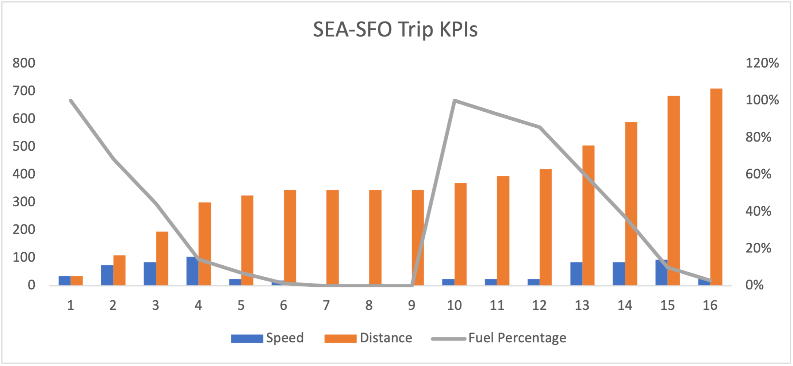
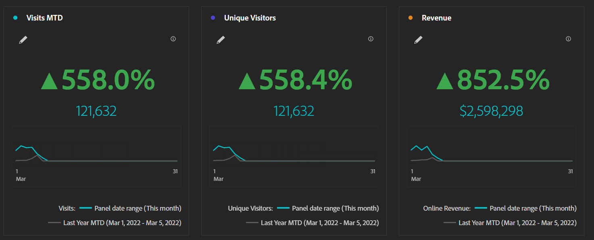
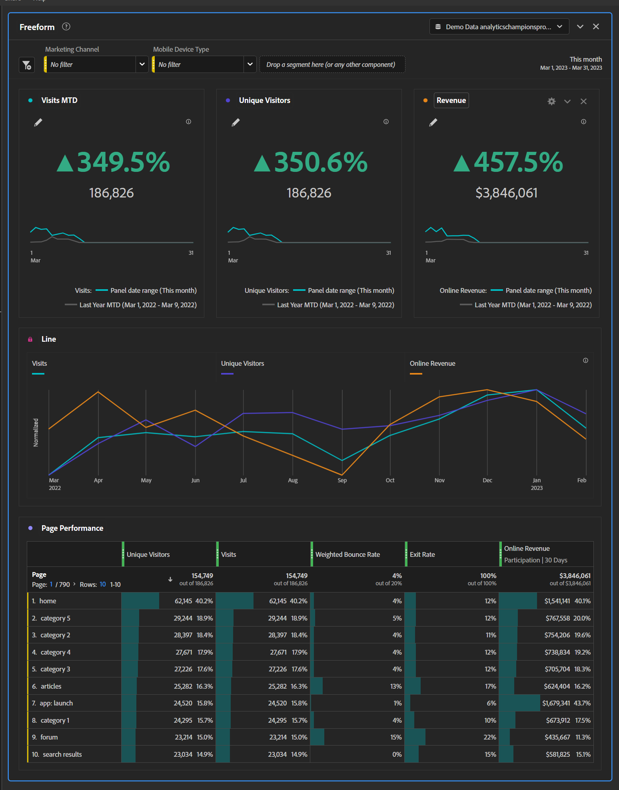

# Drive success with executive summary dashboards

_Executives often lack timely and relevant information for their sites and apps, relying on monthly Excel charts or drowning in granular data. The solution: Experience Manager Cloud Managerarketo Engagexecutive summary dashboard._

I want you to imagine driving from Seattle to San Francisco. Direction wise, it's pretty easy. Get on I-5 South for twelve to sixteen hours and you're there. Simple, right? Now, I want you to imagine that I've put a piece of cardboard over your dashboard, and I tell you that at the end
of your trip, you'll receive a dashboard that tells you your speed, fuel levels, and distance traveled:

If you examine the chart, you might notice a few things:

1.  Your speed varied wildly, well in excess of the legal speed limit at some points, and really low at other points because of things like Portland traffic

1.  Distance traveled is static for hours 6-9

1.  This is because your fuel dropped to 0% and you had to wait for roadside assistance to get through Portland traffic and refill your gas tank

Such a trip would obviously be miserable, unpredictable, and dangerous. It's no way to drive. You need continuous information about speed, distance traveled, and fuel levels to make ongoing adjustments in how you drive. No doubt, a reasonable person would rip the cardboard off the dashboard and check regularly, which would shave hours off the trip length, nearly eliminate the risk of running out of gas, and keep you moving at the right speed to avoid a speeding ticket.

So why do so many executives accept this as a reasonable way of running their sites and apps?

Many executives don't have access to ongoing, relevant information needed to take action in a timely manner. Instead, they receive a deck once a month with stats exported from [!DNL Adobe Analytics] into Excel, charted, and then plopped into a PowerPoint. If an inflection point occurs early in the month, they won't know about it until the beginning of the next month, well after they can ask questions or take action. Custom alerts are a great option too, but we all know what an exec's email inbox looks like.

You want executives to have enough data to know when their attention is needed right away, not so much that they throw up their hands in frustration. If you walk in to a message from a product owner or marketing manager that an exec wants to know about an anomaly, you're hitting the sweet spot.

This is where the executive summary dashboard comes in as the happy medium. We know the mobile scorecard is great for a quick check in for an exec on the go, but an Executive Summary Dashboard can make it easy for execs to dig in a bit deeper when they're at their desks. The mobile scorecard can alert them to an issue, but the Executive Summary Dashboard will let them then understand enough to ask the right questions from the right people.

Most execs have about three KPIs that they're deeply concerned with. In retail, it might be orders, revenue, and AOV. For B2B, leads, lead quality, and conversion rate. Services might be interested in visits, appointments, and return visitors. Whatever the three are, put them in big, bold numbers with a year over year change and a chart. The Key Metric Summary visualization makes this so easy to do:

Add in historical data for these same three metrics so it's easy to see long term trends:

Add in a couple of dropdowns for whatever is important to your organization. I find that device type and marketing channel are usually good bets:

![Social [!DNL Campaign]s.png](assets/social-campaigns.png)

These are both pretty important overall, but as always, make sure that what you choose is relevant to your site or app.

Finally, at the bottom, add some detail. I find that page performance is often popular with executives, but the key is that it's below the fold. They can seek it out if they want it, but otherwise, they have the data they need to ask questions right away:

With this final product in hand, you just need to:

-   Train your execs on how to read it

-   Train them on how to use the filters

-   Train them on how to do a basic drill down

-   Get yourself some coffee and prepare, because after they're empowered with data, executives will be coming to you with lots of questions

In conclusion, executive summary dashboards offer ongoing, relevant information for timely decision-making. Monthly decks with Excel charts are insufficient and providing too much granular data can overwhelm executives. A happy medium is to focus on the three most important KPIs with historical data and dropdowns for relevant factors. By training
executives on how to use the dashboard, they can make informed decisions and ask questions. Executive summary dashboards can improve site and app performance and drive success.

## Author

This document was written by:

**Gitai Ben-Ammi**, Principal Consultant at Concentrix Catalyst

[!DNL Adobe Analytics] Champion
