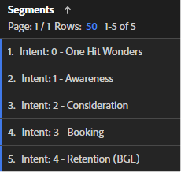
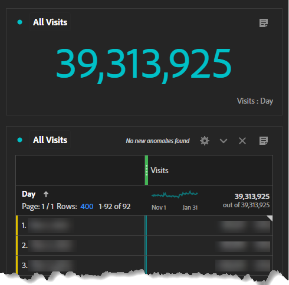
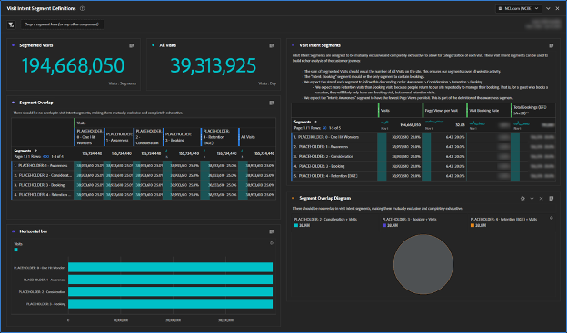

# Building Customer Journey Segments

Learn how to create behavioral-based customer journey segments in Adobe Analytics and improve your customers' experience with Adobe Experience Cloud by following this step-by-step guide.

Let's create better customer journey segments! In this series, we'll use Adobe Analytics to define behavioral-based segments, estimate audience sizes, and track user movement. By the end, you'll be able to personalize media and improve your customers' experience with Adobe Experience Cloud. Keep in mind that these segments are living and should be updated as you learn more about your customers. Although reporting may present some challenges, don't worry, I'll guide you through it! Let's start by creating our first set of Customer Journey segments, beginning with the "One Hit Wonders" segment.

Today, we'll create placeholders for our first set of Customer Journey segments, build an Adobe Analytics Workspace to help us define our segments, and define our very first segment, "One Hit Wonders."

By the end of this series, you'll be able to create customer journey segments in Adobe Analytics based on behavioral signals. You'll be able to estimate the size of each audience at each stage in the journey and understand at what rate users move between those stages. And you'll be able to export those customer journey audiences to Adobe Experience Cloud to enable personalization and media targeting.

Each business is different, and that means that your customer journey segments will look different than mine. So rather than prescribe specific formulas for your segments, suggest some things to look at and an overall process for building them. 

It's also important to note that your customer journey segments will be living segments. This is not a one-and-done exercise. As you learn more about your customers, you'll update these segments. This presents some challenges for reporting. People want consistency in their reports, and if our segment definitions change, then the numbers in the reports will also change. 

## Getting Started with Visit Intent Segments

The first step to building customer journey segments is to infer why a guest is on your website using behavior signals, and, if available, Voice of Customer data. We'll build a set of Visit Intent segments to categorize all visits on the website. At this point, our Visit Intent segments need to be mutually exclusive and completely exhaustive. Every visit should belong to one, and only one, Visit Intent segment.

The Visit Intent segments describe a visit, so we'll use the Visits container in the segment definition.

My initial set of Visit Intent segments included:

* One Hit Wonders
* Awareness
* Consideration
* Booking (Purchase)
* Retention (Manage a booking/purchase)

To make my Visit Intent segments easy to use, I prefixed my segment names with "Intent:", gave them a number to enable sorting, and tagged them "intent". My segments looked like the picture below.

 
**Go ahead and create your Visit Intent Segments using the Visits container with a placeholder definition of Page Views >= 1.** 

As we'll see, building these segments is an iterative and interconnected process. I'll describe the process of building these segments in a future post.

## The Visit Intent Segment Data Quality Workspace

 
I used a simple workspace to ensure that I was defining my Visit Intent segments well. Remember, each visit needs to belong to one, and only one, Visit Intent segment. The workspace I set up ensures that all visits are accounted for and that there is no overlap between the segments. 

I named this workspace "DATA QUALITY: Visit Intent Segments" with the tags "data quality", "visit intent", and "customer journey". Later, we'll build a "Visit Intent Dashboard" so the prefix "DATA QUALITY" indicates that this workspace is for setting up and maintaining the segments. It's an administrative dashboard that has fairly little business insight but is important to ensuring the segments are maintained. It's a good idea to routinely come back to this dashboard, or set up alerts, to make sure your segments stay correctly defined.

The most important visualization in this workspace is the Segment Overlap freeform visualization in the middle left. Using the Visits metric, create column filters for each of your Visit Intent segments, plus the All Visits segment in the right-most column. Create rows for each Visit Intent segment on the left. You'll now have a cross-tab visualization. When your segments are configured correctly, there will only be data in one column and one row, at the intersection of each Visit Intent segment with itself.

The next most important visualizations are the summary metrics at the top left. The Segmented Visits summary takes its value from the All Visits column in the Segment Overlap visualization immediately below. The All Visits summary has its own hidden table.

 
At the top right, I've added additional metrics to each of the segments to give some "flavor" to how the segments are shaping up. In particular, because these segments are mutually exclusive, I only expect to see bookings for the Booking Intent segment (fear not, we'll get to conversion rates when we make these Visit Intent segments visitor-based.

Remember that we just created placeholder segments. So, initially, your workspace will look wonky. All your Visit Intent Segments will overlap 100% because they have the same definition. This is correct, and exactly what you want to see at this point in the process. As we build the segment definitions, you'll start to see these segments begin to take shape.
 

## Building Your First Visit Intent Segment

Defining Visit Intent segments is a bit of a process of elimination, and there's a lot of interdependency between them. So I didn't build these segments in the order of the journey, I built them in order from the most easily defined to the most challenging. That gave me this order:

1. Intent: 0 - One Hit Wonders
1. Intent: 3 - Booking
1. Intent: 4 - Retention
1. Intent: 2 - Consideration
1. Intent: 1 – Awareness

Pretty random, eh? Defining these Visit Intent segments was an iterative, back-and-forth, process, and often an adjustment to one segment required updates to other segments. This will become clearer as I describe how I defined each of these segments.

Today, we'll define our first, and easiest, segment, One Hit Wonders

## Building the One Hit Wonders Segment

My first segment, "One Hit Wonders", was easy to define. It's simply any visit with only one page view. We really don't know why that user was on the website, because they bounced. I suppose we could guess an intent based on their entry page, but with only one page view, there's just not enough information to make an informed guess about intent.

 
After defining this segment, you'll begin to see your Visit Intent Workspace taking shape.

Building customer journey segments using Adobe Analytics is a challenging but rewarding process. By creating behavioral-based segments, estimating audience sizes, and tracking user movements, businesses can personalize media and improve customer experience. Each business is unique, and there are no specific formulas for creating segments, but guidelines and a process to follow. Segments should be updated as businesses learn more about their customers, which presents reporting challenges. By following the process of building Visit Intent segments, businesses can improve overall customer experience.

## Author

This document was written by:

**Aaron Fossum**, Director, Digital Analytics

Adobe Analytics Champion
