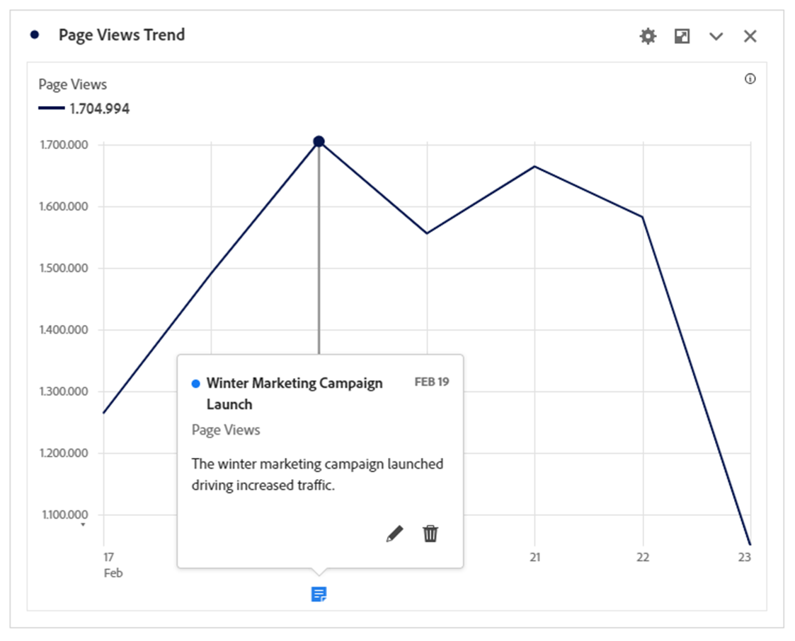
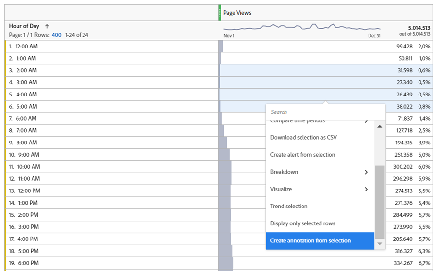
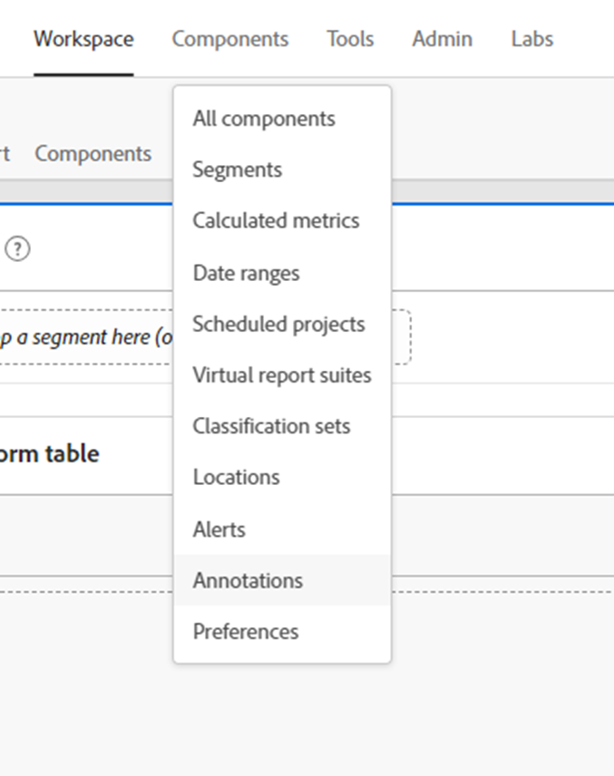
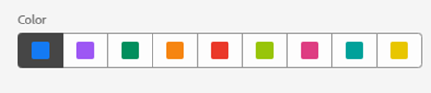
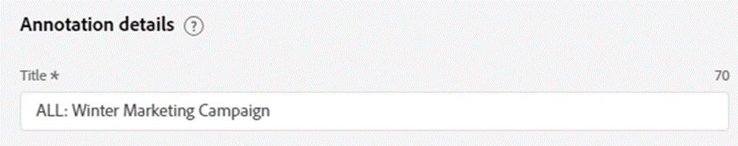
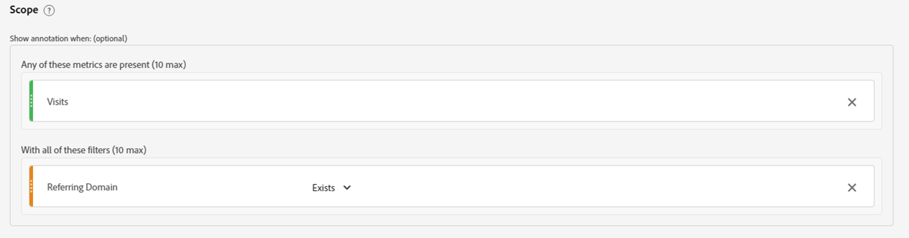
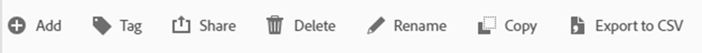
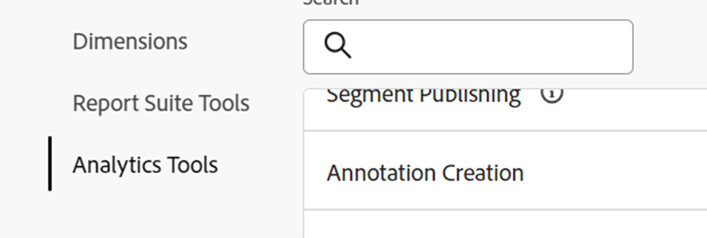

# Unlocking analytical insight; harnessing the power of annotations

The Annotations data component is one of the simplest, yet in the long-term, one of the most time-saving functionalities offered in Adobe Analysis Workspace. Unlike any other functionality within Workspace, it serves as a narrative historical memory for you and your fellow Workspace users. 

Simply put, Annotations are short description texts that can be added to date trended data within Adobe Workspace. Annotations offers context to everyone who uses Analysis Workspace in understanding your company's data history, helps more quickly analyze performance and gives all your reports a highly customized feel.

**Use Cases**

There are multiple situations where Annotations are particularly handy:

- **Outliers (Peaks & Troughs)** - if you know the reason for the major peaks and troughs of trended data, quickly right click on the outlier data point and choose "Annotate selection" to share that knowledge with everyone.

- **Major Marketing Campaigns & Tests** - as marketing campaigns and tests (A/B, multivariate, etc.) can directly impact traffic and performance, it's an easy benefit for everyone to document the timeframe of those campaigns and tests in Annotations.

- **External Factors & Events** - anything from major one-time happenings, to competitor actions, new product releases and relevant global or domestic events, be sure to add any data-relevant external factors to Annotations.

- **Gaps & Errors** - you should be using the Alerts feature to warn you of potential data collection issues, but even the most seasoned team unfortunately experiences some form of data collection errors or temporary gaps from time to time. Annotations is a great way to minimize the impact by letting users know that data is missing or incomplete.

**How-to**

Creating and editing Annotations is intuitive and almost self-explanatory. Either right-click on a data point within a date trended visualization or freeform table and choose "Annotate selection" to create an annotation or use the main navigation to "Components > Annotations" to create and edit annotations.

{width="70%"}{width="30%"}

For all the details of how Annotations work, be sure to see the [video tutorial on Experience League](https://experienceleague.adobe.com/en/docs/analytics-learn/tutorials/analysis-workspace/navigating-workspace-projects/annotations-in-analysis-workspace).

**Tips & Tricks to Get You Started**

Finally, here are some useful tips to get you started using annotations right away.  Using these suggestions will help make your annotations effective, clear and informative for all users.

- **Color Coding** - The Annotations feature allows you to select from a range of colors, which appear within your Workspace projects to help you differentiate between various types of Annotations. If you measure multiple different sites or apps, you can choose a different color for each one. Or perhaps a different color for each category of annotations.

- **Title Labelling** - An additional way to give users easy visual cues regarding an annotation, is to label the title of the annotation. Similar to color coding, you can choose different labels according to how your organization structures data, for example by channel or name (i.e. WEB, APP or ALL)

- **Scope** - When creating an annotation, you have the full range of dimensions, metrics and limiters at your disposal in order to display annotations in the proper context. Some annotations are only relevant to certain dimensions or metrics, so you can limit when an annotation is displayed to the corresponding dimension or metric.

 

- **Save As** - Once you have created an annotation or two, you can reutilize them as templates to create new annotations, by using the time-saving "Save As" option.

- **Annotation Manager** - Use the main navigation to "Components > Annotations" to reach the Annotations Manager where you'll find more extensive functionality to create and especially edit annotations.

- **Permissions -** If you don't have the ability to create Annotations, reach out to your administrator who can allow "Annotation Creation" in the Admin Console.

For detailed documentation, please visit [Annotations overview](https://experienceleague.adobe.com/en/docs/analytics/analyze/analysis-workspace/components/annotations/overview) and surrounding articles.

## Author
This document was written by:

Thomas Edward Buckley, Manager Data Warehouse & Business Intelligence at Miles & More (Lufthansa Group)

