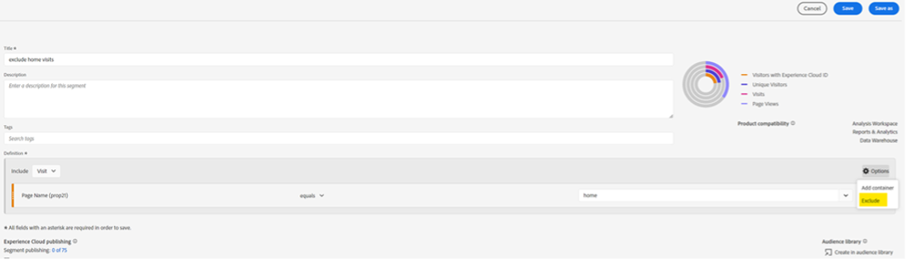
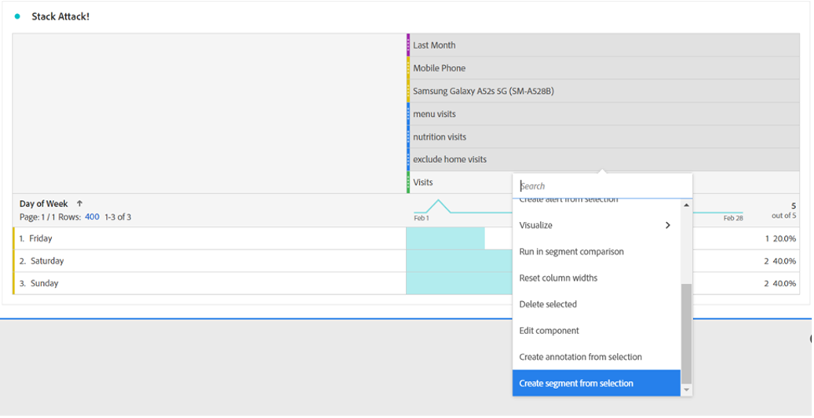
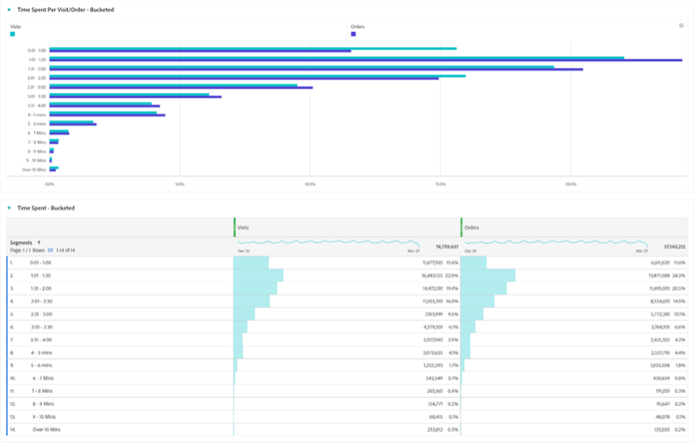

# Now just wait a segment… Using segments to discover new insights in Analysis Workspace

Whether you are a new [!DNL Adobe Analytics] user or a seasoned pro, you will leverage segments quite a bit in your Analysis Workspace projects. As [[!DNL Adobe] Experience League](https://experienceleague.adobe.com/docs/analytics/components/segmentation/seg-overview.html?lang=en) describes, "segments allow you to identify subsets of visitors based on characteristics or website interactions." While the basic outcome of this feature means isolating groups of users, visits, or hits to your site, a sharp-minded analyst such as yourself can get creative with this tool and find new ways to gain insights about your site activity. The list of possible options is vast, so don't hesitate to try creating your own and share it with others at your organization or online in communities like the [[!DNL Adobe Analytics] Community](https://experienceleaguecommunities.adobe.com/t5/adobe-analytics/ct-p/adobe-analytics-community) on Experience League or the [#Measure Slack](https://www.measure.chat/) community.

If you need a quick refresher on how to create a segment, please check out the Experience League documentation on using the [Segment Builder](https://experienceleague.adobe.com/docs/analytics/components/segmentation/segmentation-workflow/seg-build.html?lang=en) in Analysis Workspace.

## Comparing and Contrasting Segments

In Analysis Workspace you can compare two segments using "[Segment comparison](https://experienceleague.adobe.com/docs/analytics/analyze/analysis-workspace/panels/segment-comparison/segment-comparison.html?lang=en)". Segment comparison can be found in the Panels section of the left navigation bar:

However, sometimes you do not need a full panel of comparison to drive home key insights to your end users. Thankfully some features can be compared in a standard panel as well.

The [Venn diagram visualization](https://experienceleague.adobe.com/docs/analytics/analyze/analysis-workspace/visualizations/venn.html?lang=en) can help create a quick comparison, allowing you to hover and see the overlapping sessions, orders, users, etc. between 2-3 custom segments. You can also quickly build segments by right-clicking on any of the overlapping sections:

Sometimes the important information is not in the overlapping data, but the data that does not overlap. A quick way to view this is to create a copy of one segment and make it an "Exclude" segment:

By stacking your "exclude" segment with the other segment in your comparison, you can now quickly calculate how many visits hit your menu page without also viewing the home page in the same session:

## Stack Attack

Similarly, you can create the intersecting data of a Venn diagram by simply stacking any segments together. There is no limit to how many segments or individual dimensions you stack. For example, if I wanted to quickly find out what Days of the Week last month my site had a visit on a Mobile Phone, specifically a Samsung Galaxy A52s, that did see my menu and nutrition pages, but did NOT see my home page, I can build it quickly on the fly like this:

But even better, once I find that perfect subset of my user or visit base, I can select all those values, right click, and create a segment instantly:

That's a lot of power in one segment.

## A Segment of Numbers for a Number of Segments

Many users often look at nominal, ordinal, or interval values when building segments - things like a page visited, an age range of users, or the number of visits a user has made in the past. However, you can use ratio data as well when creating a segment by bucketing these values - whether they're standard dimensions, standard metrics, or custom variables and metrics for your organization.

For example, Time Spent on Page or Time Spent per Visit has pre-built buckets available:

However, these may not always fit your organization's needs - perhaps most of the site's visits run shorter than 10 minutes. You can use granular measurement to create differently sized buckets. Here is one created to look at visits that last between 1 minute, 1 second and 1 minute, 30 seconds:

Once created, I can now start to look at my visits, orders, and other events by the different bucketed time groups I customized:

You can even begin to examine how your Key Performance Indicators (KPIs) change as a factor of how much time a user spends, how many pages they hit in a visit, how many times they've visited in the past, or any other numeric value - basically allowing you to look at a metric as a factor of another metric:

The possibilities for using segments to find new insights are endless! This is simply a starting point. Try a few on your own and let the community know what you discover: [[!DNL Adobe Analytics] Community](https://experienceleaguecommunities.adobe.com/t5/adobe-analytics/ct-p/adobe-analytics-community) on Experience League or the [#Measure Slack](https://www.measure.chat/) community.

Happy segmenting!

## Author

This document was written by:

**Dan Cummings**, Sr. Product Engineering [!DNL Analytics] Manager at McDonald's Corporation

[!DNL Adobe Analytics] Champion
