# The magic behind the curtain: Complex segments: excludes, containers, and attribution

_Uncover the intricacies of complex data segmentation, exploring excludes, containers, and attribution models. Like a magician's sleight of hand, mastering these techniques empowers analysts to perform data magic, transforming insights with precision and finesse._

The curtains are open, the stage is set... this may not be a Las Vegas magic act, but we can perform some pretty amazing tricks when building our segments. 

Inside this module we will cover:

- Exclude logic
- Using containers
- Attribution model

## Include vs exclude

By default, all containers start as **include** type, basically meaning that they return the data that matches the criteria. However, you can also change the segment, or containers within the segments to be **exclude** type, allowing you to reject certain criteria.

While a magician can find your card in the deck, it's amazing when that magician can make the rest of the deck not exist. Similarly, in exclude segments, we want the unwanted data to simply vanish from our data set.

You might be sitting there thinking, "Ok, but I already have 'Does not Equal' and 'Does not Contain' options, so shouldn't that cover me?" Unfortunately, the answer to that is no... and it's not just about being able to exclude groups of logic, over a single element. Even when dealing with a single component, you will often need to use *excludes* to achieve your goal.

- **Does not contain / Does not equal** - Is just what it sounds like, matching on items that don't contain a specific string
- **Exclude: Value contains / equals** - This will *exclude* items that match the string

At first glance, these both sound the same... and on **hit** level segments / containers, you would be correct, as they will perform the same action. However, when using **visit** or **visitor** scope you will get vastly different results.

**Figure 1: Does not contain / does not equal - Hit scope**

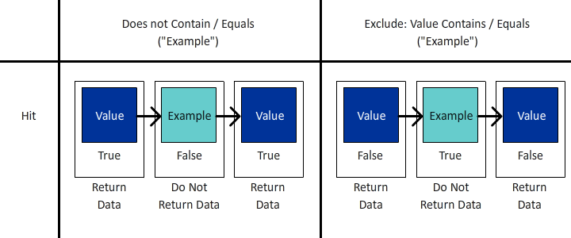

*Notice that each hit returns a true or false value, and that those values are reversed between does not and exclude.* 

- Does "Value" not contain "Example" (yes), therefore return true, and include that hit; likewise, does "Example" not contain "Example" (no, it does contain it), therefore return false and do not include that hit. Basically, return any data that returns a true result.
- Does "Value" contain "Example" (no), therefore return false, and do not exclude that hit; likewise, does "Example" contain "Example" (yes), therefore return true, and exclude that hit. Basically, return data that does **not** have a true result, or return data that is false to your criteria.
- You can see that at the **Hit** level, both sets of logic will return the same set of data.

**Figure 2: Does not contain / does not equal - Visit scope**

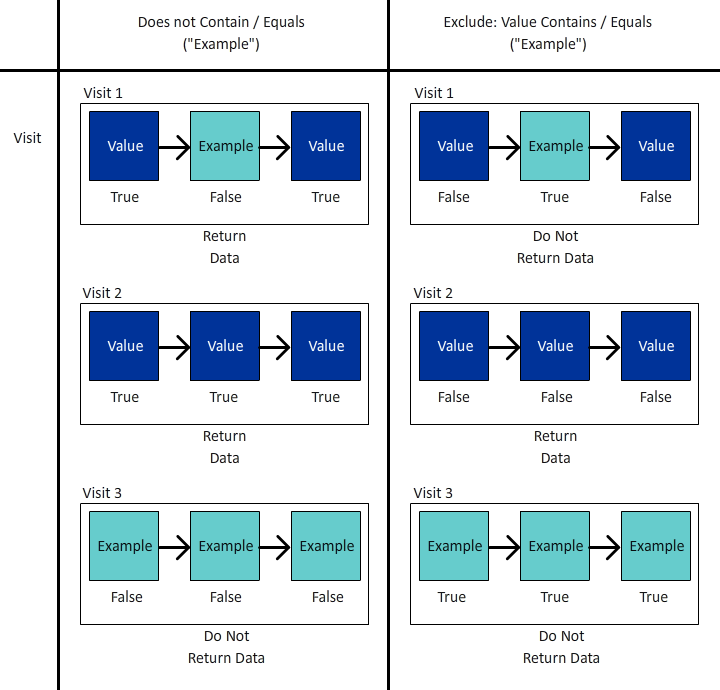

*Like above, each hit inside the **visit** will be evaluated with the same true / false. However, the data set that is returned is that of the entire visit.* 

- On each hit does "Value" not contain "Example" (yes), therefore return true; likewise, does "Example" not contain "Example" (no, it does contain it), therefore return false.
  - If **any** hit in the visit returns **true**, then the **whole visit** is returned.*
  - If the visit was entirely made up of hits that contained "Example" then no hits would return true, and therefore that visit would **not be returned** in your data set.
- Again, on each hit does "Example" contain "Example" (yes), therefore return true
  - If **any hit** returns **true**, the entire visit will be **excluded**
  - If **all the hits** in the visit return **false**, then that visit will be returned in your data set
- Now you can see where this logic begins to diverge. In the example above there are three distinct visits:
  - When using "Does Not Contain / Equal" **two of the three** visits will be returned.
  - When using "Exclude Contains / Equals" **only one** of those visits will be returned

**Figure 3: Does not contain / does not equal - Visit scope**

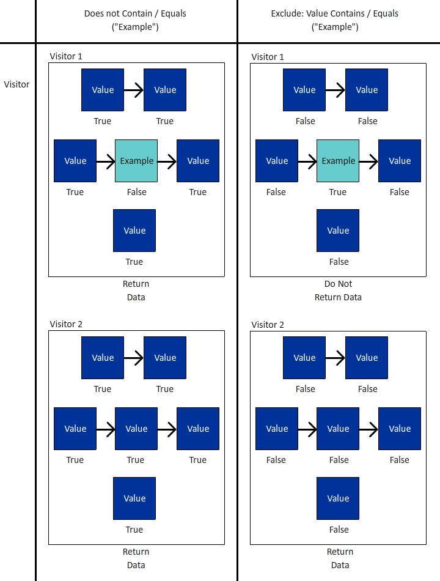

*Like above, each hit made by the **visitor** will be evaluated with the same true / false logic. But now we are looking at all the hits that this visitor has made, across all visits (within the selected date range).* 

- On each hit does "Value" not contain "Example" (yes), therefore return true; likewise, does "Example" not contain "Example" (no, it does contain it), therefore return false.
  - If **any** hit made by the visitor returns **true**, then the **whole visit** is returned. 
  - If the visitor never made any hit that contained "Example" then no hits would return true, and therefore that visitor would **not be returned** in your data set.
- Again, on each hit does "Example" contain "Example" (yes), therefore return true.
  - If **any hit** returns **true**, the entire visitor (and subsequently all their visits) will be **excluded.**
  - If **all the hits** in the visit return **false**, then that visitor will be returned in your data set, thereby successfully returning visitors that did not do "X".
- This is an extension of the visit logic, where there are even more considerations. In the example above there are two distinct visitors, with 3 visits each:
  - When using "Does Not Contain / Equal" **both** visitors will be returned, as will all **three** of their visits (accounting for 2 visitors and 6 total visits in your reports)
  - When using "Exclude Contains / Equals" **only one** of those visitors will be returned, and only the three visits associated to that visitor will be included (accounting for 1 visitor and 3 total visits in your reports)

>[!TIP]
>
>This logic can be complex, especially when you start nesting containers... it's always a good idea to test against controlled sample data to ensure that your segment is in fact returning the data you think it should.

### Segment example 1: Exclude visits that make a purchase

In this example, I want to target users that came to a site, and did *not* make a purchase during their visit (basically, I want to exclude the visits that performed a transaction; therefore, I will be left with the visits that did not complete a transaction)

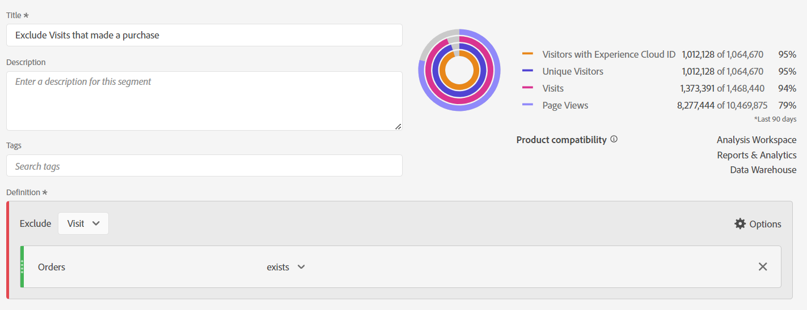

For comparison, let's look at a segment that is built using "Does not exist":

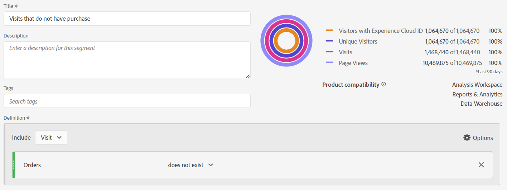

Notice how the preview shows a very different result... in fact, this segment will return 100% of my visits, because every visit has at least one hit that does not include the "Order" metric.

To illustrate this further, let's compare the two segments side by side:

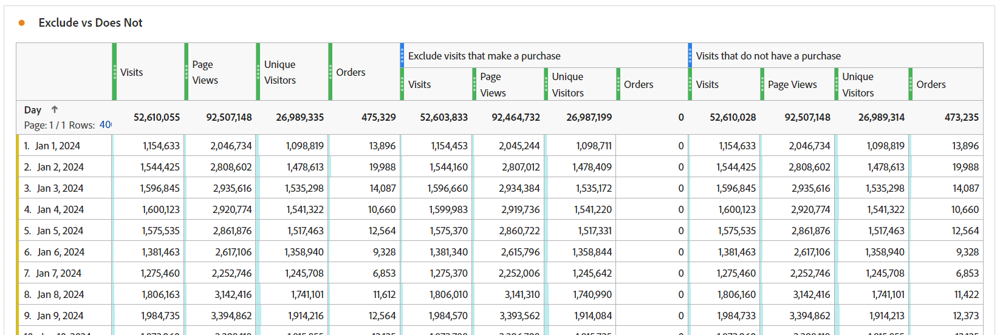

First, you can see that despite the *visit* level scope of the segment, we can pair the segment with other metrics (such as page views or unique visitors). The first set of columns are unsegmented, to show at a glance that the one segment (does not exist) is returning almost 100% of data, only the exclude segment is doing what we need it to do. 

The most noticeable column is the orders, which should be immediately obvious that the "Does not exist" container is wrong, as most of the orders are still being returned.

### Segment example 2: Exclude visitors that have made a purchase within the reporting period

In this example, I want to use the ideas from the previous sample (which looked specifically at the visit level) and expand it to find the visitors that haven't made a purchase within the time frame of my report.

This segment is going to look very similar to the above example, almost identical, but the scope of the segment is going to make a big difference.

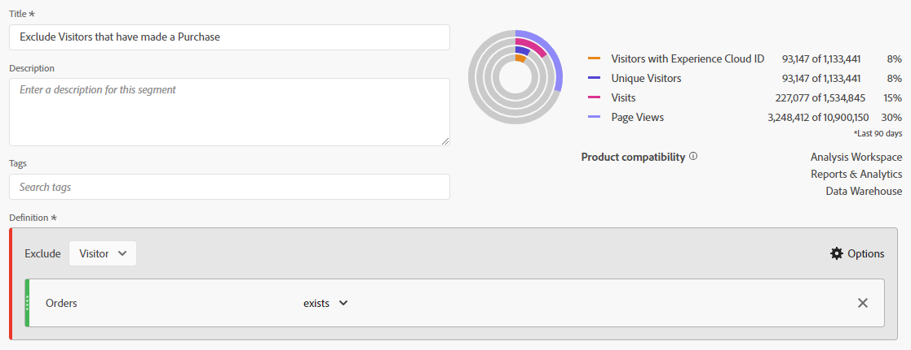

Now, if we compare the visitor scoped segment to the visit scoped segment above, you will see that much more data, and many more visits are excluded, since *visitors who made purchases* also had visits where no purchases were made, and so, those visits are also excluded as they are part of the visitor's lifecycle.

>[!IMPORTANT]
>
>When you are looking a visitor scoped data, the longer your report time frame, the larger the exclusion will be, since many visitors will be loyal returning visitors to your site (of course, some business models will see a higher impact than others)

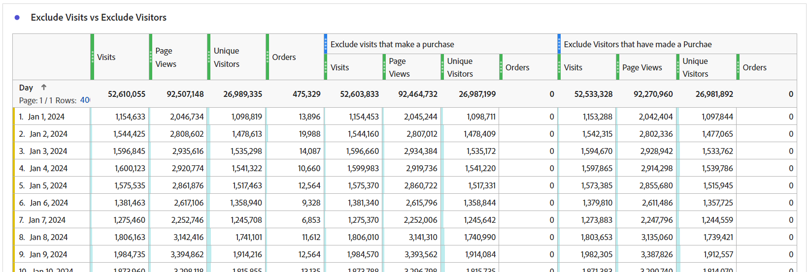

>[!IMPORTANT]
>
>While the differences between visit and visitor can be *subtle* (particularly in this sample data), they are unique logic that should be considered. Your data may be strikingly different depending on your site and user behaviors.

It's important to know exactly what data, or what *story*, you are trying to tell with your report. Ensuring that your tables and visualizations clearly tell the audience ***what*** is being shown, and using the appropriate segment model is critical to making appropriate analysis. Informed decisions can only be made properly if everyone understands what they are looking at.

## Using containers

Containers provide us with the ability to create "sub-logic" within the main logic of the segment, and a common misconception is that the scope all must be the same between the segment and the container... but it doesn't. This gives us more freedom to create specific scenarios in the greater scheme of things, to build out complex logic.

The best way to think about containers is to imagine each container being a box, and that we can stack boxes (of logic) within another box, within another box... but unlike physical boxes where each box must be smaller than the outer box, we can put something bigger inside if that drives us to get the correct data back. Think of it like a magician's hat, where the impossible can fit inside and we are the magicians of data...

### Scope of containers

Let's first do a quick breakdown of *container* scope. Like *segment s*cope, you have your basic **hit**, **visit** and **visitor** scope options, but sometimes you will also see something called **logic group** in place of visitor (this will only occur within sequential segments, and we'll cover those in the next article).

Adding containers inside your segment (or within other containers) can be achieved through accessing the **options*** menu (when nesting multiple items, be careful to add to the correct block - though luckily you can drag and drop containers within the interface if you do add it to the wrong location)

**Figure 1: Adding a container**

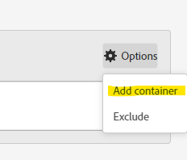

The scope of a container is independent of the parent, as I mentioned above, these *do not* have to match, and depending on what you want to return, you may need to draw out the plan to fully visualize what you need, at least until you get comfortable visualizing it in your head.

**Figure 2: Segment scope vs container scope**

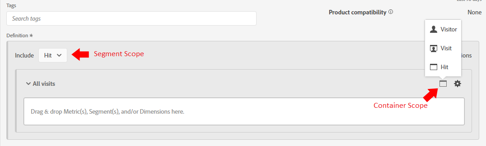

>[!NOTE]
>
>Adobe has logic to understand valid and invalid segments, they wouldn't provide you options that could *never* work... so if you see the option to use a visitor scoped container within a hit scoped segment, this means it's a valid option.

Just like for basic segments, when you start to build a complex segment with nested containers, you need to have a clear idea about ***what*** kind of data you want to be returned. ***How*** do you plan on using that data? ***Which*** metrics are you planning on pairing with the segment? 

These questions will help determine what the scope of the segment as a whole will be, this is the starting point to any segment.

Just because you plan to pair a segment with your unique visitors metric does not mean that segment itself should be visitor level... far from it. A visitor level segment will return all data for a visitor... this means all their visits, all their page views etc... once a visitor matches your segment criteria, your segment could start to return data from the *past* for this visitor (so long as it's within the date range of your workspace).

>[!IMPORTANT]
>
>Even when planning to pair a segment with the unique visitors metric, this *does not mean* that the segment should automatically be visitor scoped... This misconception *might* create inflated and incorrect results.

So, I've talked a lot about the concepts of how to select the proper scope, but not provided examples or specifics that will really help you... so let's dive into that now with a few real use case examples. They say a magician never reveals their secrets, but that's not quite true. Within the magic world the techniques and "behind the curtain" workings are often shared with peers, allowing them to build on and improve the illusion, and that is what I aim to do... to open the door to the possibilities that await you.

### Segment example 3: Views on specific pages from visitors that have made a recent order (within reporting period)

In this scenario, I only want to return a set of specific pages that were hit by recent purchasers (note that I can still pair this with visits or unique visitors, even though the segment itself will be at a HIT scope). 

This type of scenario is good for looking at if I have purchasers looking at specific pages on a site, pages that may not be explicitly connected to a specific event. 

My example is going to look at the pages of "Featured Deals" and "Recommended Products". Currently, we are going to keep the logic simple and not get into sequential segmentation (at least not yet, but we'll address more complex logic like that in a future article). 

Another question is **why** are we pulling back by hits? Technically I could pull by Visits or Visitors here, but I may want to also look at these specific pages by **page views (for the specific page set) per visit** or **page views (for the specific set) per visitor**, this scope gives me the flexibility to perform this specific math. Since these hits can easily be paired with visits or unique visitors to determine the number of visits or visitors that see these pages, I will opt for the most flexible segment that I can use for all scenarios.

First, for comparison, here is a simple HIT based segment for the specific pages.

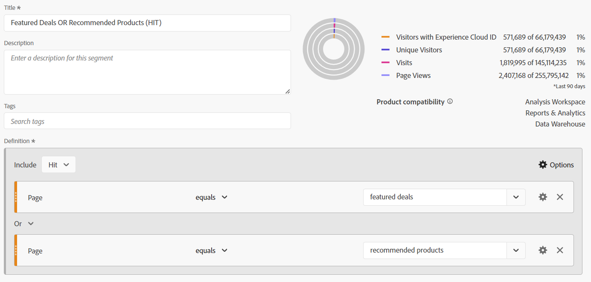

Now, let's build in the complexity:

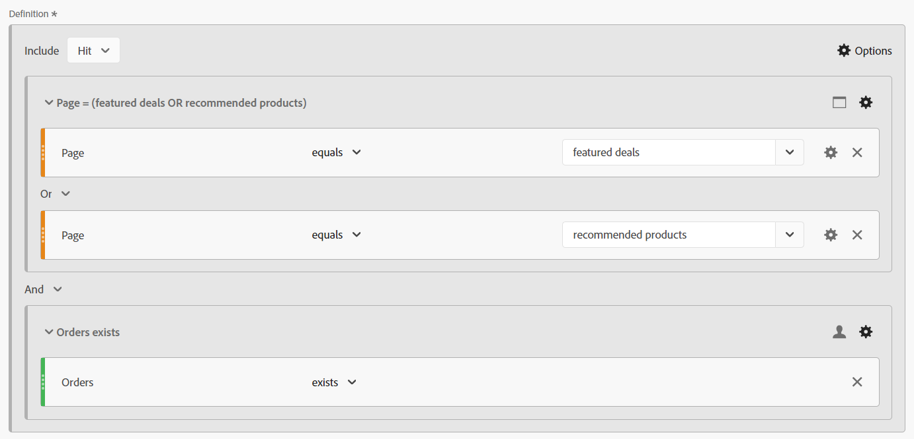

You will note that I am not only using multiple containers, but that I am mixing the scope of those containers. The Segment as a whole is at HIT level, but I am also looking for VISITORS that have made an order.

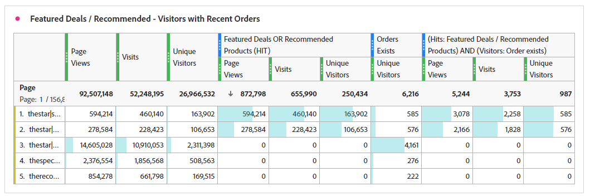

Let's spend a little time to unpack this, as there's a lot going on.

First, instead of showing a daily breakdown, I am showing a page breakdown, as I think this will help illustrate the two segments better.

<table border="0">
    <tr>
        <td width="352" style="border: 0;">The first three columns (Page views, visits and unique visitors) are unsegmented, and thus show all pages within the site. Note that I did not include orders here, since orders is tracked on an action, and therefore not part of the scope of the page dimension.</td>
        <td style="border: 0;">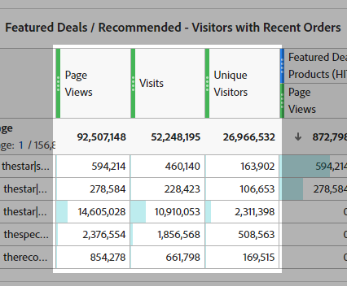
    </tr>
</table>

<table border="0">
    <tr>
        <td width="352" style="border: 0;">Next, I am showing the result of the simple segment, looking only at <strong>hits</strong> on the two specified pages. You will notice that the other pages in the breakdown all result in 0, as expected.</td>
        <td style="border: 0;">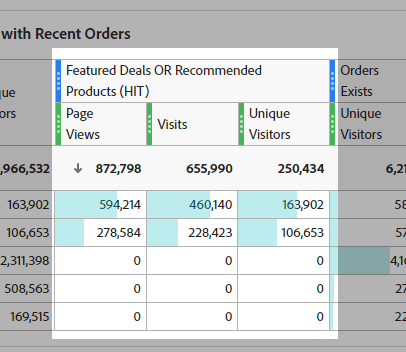
    </tr>
</table>

<table border="0">
    <tr>
        <td width="352" style="border: 0;">Now, here is a little bonus tip, before I show the result of the advanced segment, I used another simple segment of "Orders Exists" (at a HIT level scope), and I paired it with unique visitors. This will return me the total UVs that made orders in my report period, as well as the UVs that hit each of those pages... this will help to illustrate the next set of columns better.</td>
        <td style="border: 0;">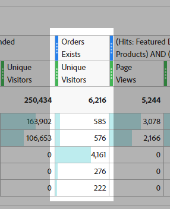
    </tr>
</table>

<table>
    <tr>
        <td width="352" style="border: 0;">The final set of columns are stacked with my complex segment. The overall UVs with orders matches the simple "Orders Exists" segment at each page, but you will notice that the total is significantly different; since this set of data explicitly restricts the data set only to visitors that made orders AND hit the pages, I am explicitly interested in.</td> <td style="border: 0;">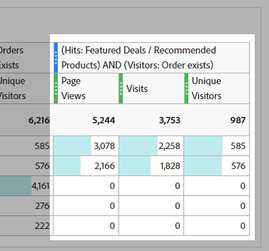
        </td>
    </tr>
</table>

### Segment example 4: Visits that hit featured deals OR recommended products AND make an order within the same visit

The above sample showed how you can add a greater scope container (i.e. visitor) inside a smaller scoped container (i.e. hit so it should come as no surprise that you can add hit containers inside of visitor or visit scoped segments. 

Using some of the same pages we were looking at previously, now we just care about getting the visitors back who happened hit either the featured deals OR the recommended products page AND made an order within the same visit.

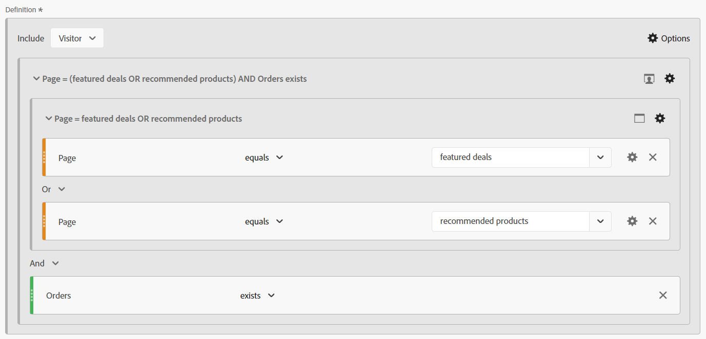

This segment mixes all three scopes. The top level of the segment is visitor, so this will ensure that ALL hits from all visits are returned for the matching visitor. Inside of that, we have added a visit scope container, this is going to ensure that the visitor must have had at least one visit that matches the specific criteria of making an order AND having visited specific pages. We have added a hit scope container for the pages themselves, so that we can use OR logic to look for either the featured deals page OR the recommended products page.

The benefit to this visitor scoped segment is that this will return **ALL** visits from the visitors that match this criteria, so this segment will be good if I want to see the behaviors in previous visits leading up to this combination, and the actions of these visitors after such a scenario. 

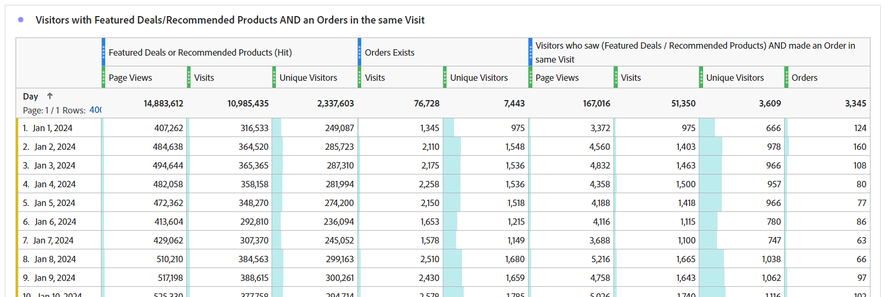

Here I am comparing hits on featured deals/recommended content, to orders exists, to the complex segment where both the order and one of the specified pages exist in the same visit. The complex segment is where the two first segments intersect; but since it's visitor scope, all the other visits for those visitors will be returned as well. 

## Attribution model

Attribution modeling within a segment definition pertains mostly to dimensions that have a non-hit expiry, so props (that are always hit level) aren't really a good candidate. Your eVars, marketing channels, etc. however, are really what these settings are designed for.

Before we look at the segment, we should do a quick review of how attribution modeling works in a simple example.

Let's say we have two eVars, one of them is set to visit expiry (eVar1), and one of them is set to a 30-day expiry (eVar2). For simplicity, we are going to track an internal campaign (icid).

**Visit 1**

- Page A
  - **eVar1** is not set
  - **eVar2** is not set
- Click on Promo Banner with ?icid=promo-banner in the URL
- Page B
  - **eVar1** and **eVar2** are set to "promo-banner"
  - **Instance of eVar1** is triggered
  - **Instance of eVar2** is triggered
- Page C
  - Both **eVar1** and **eVar2** maintain the value "promo-banner"
  - Neither of the instance metrics for the eVars is fired, as both eVars are using persisted values

**Visit 2**

- Page D
  - **eVar1** is not set to any value, and no **Instance of eVar1** is triggered
  - **eVar2** maintains the "promo-banner" value due to 30-day expiry
  - **Instance of eVar2** is not triggered, because the value is persistent and not actually set
- Click on Side Rail Promotion with ?icid=promo-side-rail in the URL
- Page E
  - **eVar1** and **eVar2** are set to "promo-side-rail"
  - **Instance of eVar1** is triggered
  - **Instance of eVar2** is triggered
- Page F
  - Both **eVar1** and **eVar2** maintain the value "promo-side-rail"
  - Neither of the instance metrics for the eVars is fired, as both eVars are using persisted values

Currently, here is the expected outcome from these two visits:

<table><tr><th colspan="1" valign="top"></th><th colspan="1" valign="top"></th><th colspan="1" valign="top"><b>Page Views</b></th><th colspan="1" valign="top"><b>Visits</b></th><th colspan="1" valign="top"><b>Instance of eVar1</b></th><th colspan="1" valign="top"><b>Instance of eVar2</b></th></tr>
<tr><td colspan="1" valign="top"></td><td colspan="1" valign="top"></td><td colspan="1" valign="top">6</td><td colspan="1" valign="top">2</td><td colspan="1" valign="top">2</td><td colspan="1" valign="top">2</td></tr>
<tr><td colspan="1" rowspan="7" valign="top">Page</td><td colspan="1" valign="top"></td><td colspan="1" valign="top">6</td><td colspan="1" valign="top">2</td><td colspan="1" valign="top">2</td><td colspan="1" valign="top">2</td></tr>
<tr><td colspan="1" valign="top">Page A</td><td colspan="1" valign="top">1</td><td colspan="1" valign="top">1</td><td colspan="1" valign="top">0</td><td colspan="1" valign="top">0</td></tr>
<tr><td colspan="1" valign="top">Page B</td><td colspan="1" valign="top">1</td><td colspan="1" valign="top">1</td><td colspan="1" valign="top">1</td><td colspan="1" valign="top">1</td></tr>
<tr><td colspan="1" valign="top">Page C</td><td colspan="1" valign="top">1</td><td colspan="1" valign="top">1</td><td colspan="1" valign="top">0</td><td colspan="1" valign="top">0</td></tr>
<tr><td colspan="1" valign="top">Page D</td><td colspan="1" valign="top">1</td><td colspan="1" valign="top">1</td><td colspan="1" valign="top">0</td><td colspan="1" valign="top">0</td></tr>
<tr><td colspan="1" valign="top">Page E</td><td colspan="1" valign="top">1</td><td colspan="1" valign="top">1</td><td colspan="1" valign="top">1</td><td colspan="1" valign="top">1</td></tr>
<tr><td colspan="1" valign="top">Page F</td><td colspan="1" valign="top">1</td><td colspan="1" valign="top">1</td><td colspan="1" valign="top">0</td><td colspan="1" valign="top">0</td></tr>
</table>

<table><tr><th colspan="1" valign="top"></th><th colspan="1" valign="top"></th><th colspan="1" valign="top"><b>Page Views</b></th><th colspan="1" valign="top"><b>Visits</b></th><th colspan="1" valign="top"><b>Instance of eVar1</b></th></tr>
<tr><td colspan="1" valign="top"></td><td colspan="1" valign="top"></td><td colspan="1" valign="top">4</td><td colspan="1" valign="top">2</td><td colspan="1" valign="top">2</td></tr>
<tr><td colspan="1" rowspan="3" valign="top">eVar1</td><td colspan="1" valign="top"></td><td colspan="1" valign="top">4</td><td colspan="1" valign="top">2</td><td colspan="1" valign="top">2</td></tr>
<tr><td colspan="1" valign="top">promo-banner</td><td colspan="1" valign="top">2</td><td colspan="1" valign="top">1</td><td colspan="1" valign="top">1</td></tr>
<tr><td colspan="1" valign="top">promo-side-rail</td><td colspan="1" valign="top">2</td><td colspan="1" valign="top">1</td><td colspan="1" valign="top">1</td></tr>
</table>

<table><tr><th colspan="1" valign="top"></th><th colspan="1" valign="top"></th><th colspan="1" valign="top"><b>Page Views</b></th><th colspan="1" valign="top"><b>Visits</b></th><th colspan="1" valign="top"><b>Instance of eVar2</b></th></tr>
<tr><td colspan="1" valign="top"></td><td colspan="1" valign="top"></td><td colspan="1" valign="top">5</td><td colspan="1" valign="top">2</td><td colspan="1" valign="top">2</td></tr>
<tr><td colspan="1" rowspan="3" valign="top">eVar2</td><td colspan="1" valign="top"></td><td colspan="1" valign="top">5</td><td colspan="1" valign="top">2</td><td colspan="1" valign="top">2</td></tr>
<tr><td colspan="1" valign="top">promo-banner</td><td colspan="1" valign="top">3</td><td colspan="1" valign="top">2</td><td colspan="1" valign="top">1</td></tr>
<tr><td colspan="1" valign="top">promo-side-rail</td><td colspan="1" valign="top">2</td><td colspan="1" valign="top">1</td><td colspan="1" valign="top">1</td></tr>
</table>

Now, let's look at where you can set attribution in your segment.

**Figure 4: Attribution model**

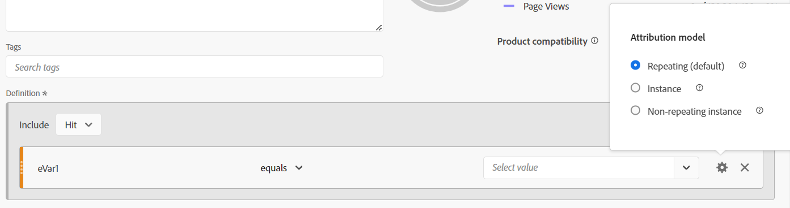

*The gear icon on your dimension is where you can set attribution. Each option has information available when hovering over the "?" icon. Basically:*

- The default behavior will return all instance of the eVar where the value is set (either specifically or through the set attribution)
- Instance will only return the dimension where the value is explicitly set (i.e. on the hits where the "Instance of eVar" is triggered)
- The non-repeating Instance will only return the first time the value of the dimension is set (i.e. while not covered in the example above, imagine the user clicked on the promo banner multiple times, this would also increment the "Instance of eVar" for each time the banner was clicked, this setting would only take the first unique instance of "promo-banner" and ignore any subsequent counts of this banner)

### Segment example 5: Marketing channel "Paid Search" vs the direct instances of paid search

As we should all know, marketing channels have a long attribution model (30 days by default, but this could be customized to your own needs), and once set, the marketing channel will not be overwritten by subsequent "direct" visits to the site, so that your specific drivers will get the conversion attribution. However, sometimes you need to see specifically the ***entries*** into your site by a specific marketing channel; and by entries, I mean you need to see when the marketing channel is specifically set based on your marketing processing rules.

Let's change things up and start by looking at the comparisons, then we'll dig into the segments.

<table>
    <tr>
        <td width="352" style="border: 0;">The first 4 columns are unsegmented and should be easy to understand. Note that *"Entries"* is basically a calculated value based on where visitors start the session. I've added it here to show that this doesn't return the information we are looking for, as users may enter the site through multiple marketing channels (through looking at social media, doing searches, clicking on marketing emails, etc. all within the same visit / session).</td> <td style="border: 0;">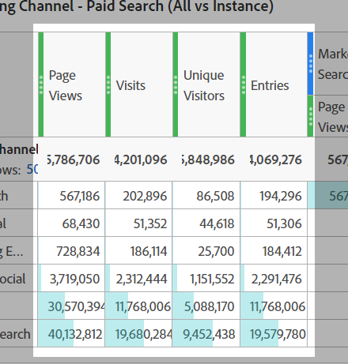
        </td>
    </tr>
</table>

<table>
    <tr>
        <td width="352" style="border: 0;">The next set of columns uses a "Standard Hit Segment", basically looking at hits where the marketing channel is "paid search". However, this will return ALL hits based on the Marketing Channel attribution, it won't isolate the actual "Paid Search" click-throughs. Therefore, this won't return the data we need.</td> <td style="border: 0;">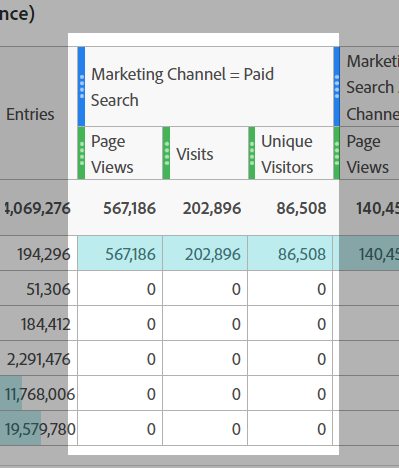
        </td>
    </tr>
</table>

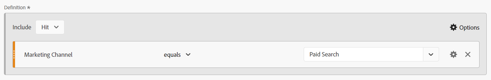

<table>
    <tr>
        <td width="352" style="border: 0;">Now, the next two sets of data look identical, and in fact, these will return the same data in two different ways. But now I am specifically looking the <i>instances</i> where the marketing channel was <strong>set</strong> to "Paid Search".</td> <td style="border: 0;">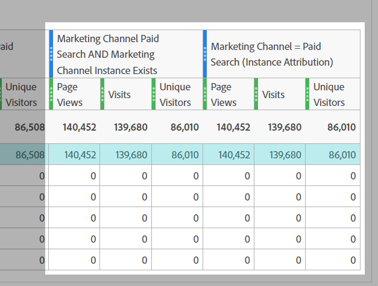
        </td>
    </tr>
</table>

This can be done in two ways:

First, this is using the "standard" dimension attribution, and pairing this with the specific "Marketing Channel Instance" metric (as an *exists* logic):

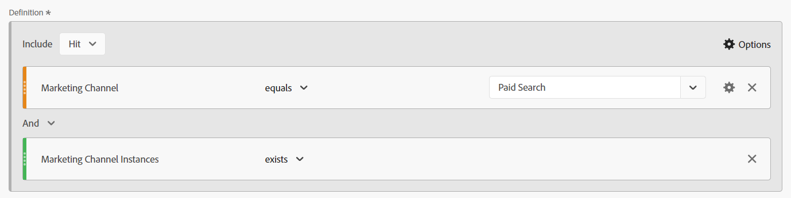

Or second, for a simpler segment, you can change the attribution to "Instance". Notice that the dimension name will change from "Marketing Channel" to "Marketing Channel (Instance)".

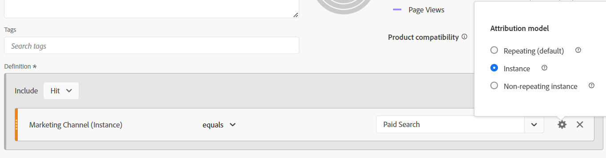

## Putting it All Together

Like any good magician, we can start with each individual trick, building the audience up as we go, leading them to the final "prestige". This is where we really shine, by taking all the little tricks, and roll them up into a grand finale. Taking the seemingly disconnected parts of the trick, and showing that in fact, they all work together to form a cohesive whole.

### Segment example 6: Visitors that have made an order during a visit with paid social instance and excluding visitors that are signed up for any newsletter

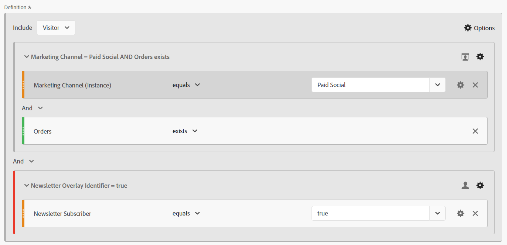

This will allow me to identify visitors who have actively made a purchase during a visit from a social media campaign but have not signed up for our newsletters. This will allow our marketing team to see the potential group of users to try and convert for newsletters and marketing emails.

## Finale

There are so many ways to combine the logic to get into very detailed scenarios, that I can only scratch the surface of the possibilities. 

Like any great magician, the true power is in inspiring the up-and-coming generation to build on the basics, to re-imagine the learnings into something new and wonderful! I look forward to seeing what you all come up with!

## Author

This document was written by:

Jennifer Dungan, Optimization Manager Analytics at Torstar

Adobe Analytics Champion
