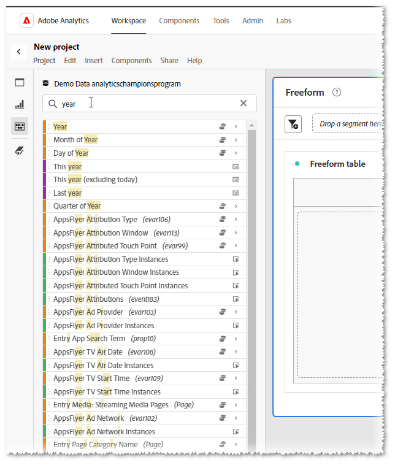
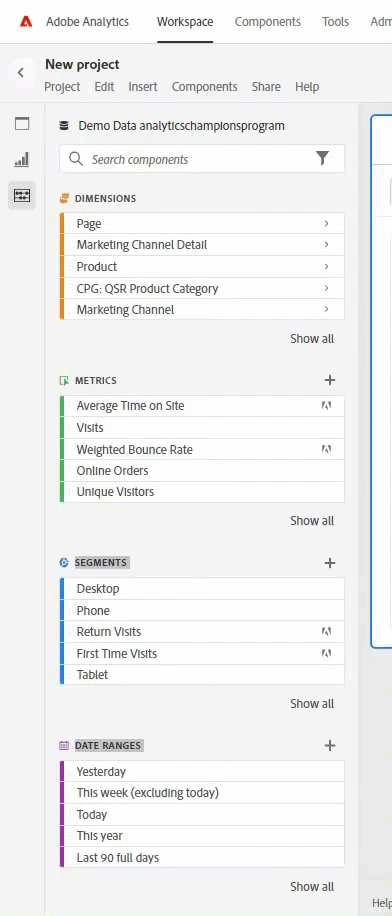
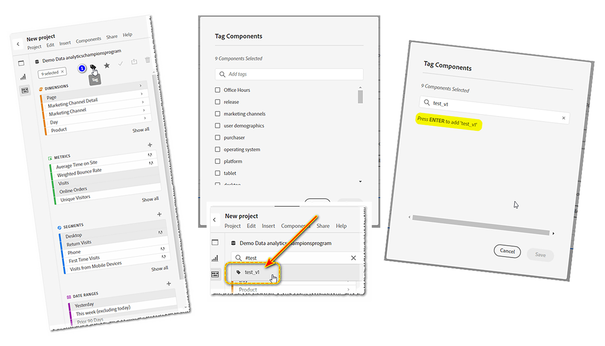
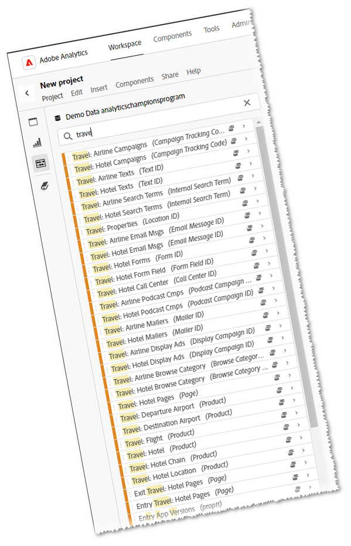
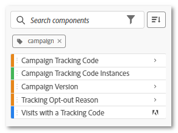

# #Tags - your personal assistant

_Discover how #TAGS can streamline your digital analytics, serving as your personal assistant to find what you need efficiently. Jeff Bloomer, Adobe Analytics Champion, shares expert insights on maximizing the tool's potential for your benefit._

Everyone remembers playing a good game of tag or even hide and seek, back when we were kids, right?

The best part was when we were the ones who either made it back to base (tag) or stayed hidden the longest (hide and seek) until we heard someone yell, "Olly Olly oxen free!" ("All ye all ye outs in free," derived from the German: "alle alle auch sind frei!").  Which ultimately meant everyone else had either made it to base, been found, or someone was tagged "it," and we were still free to play another round!

The important part is whether the game was tag or hide and seek, we were playing a fun activity where everyone was found again and again.

When we turn to our daily jobs, searching for things appears to become a lot less adventurous and a lot more tedious. But it doesn't have to be if we are willing to put in just a little bit of work on the front end.  A phrase well known by my family is, "Most pain is self-inflicted." However, though it may seem a little old-fashioned these days, there is a more famous phrase that is also highly relevant in this situation: "A stitch in time saves nine." - Benjamin Franklin

Now that I have your attention, let me begin by asking a question:

How many of you have done this?  You have begun searching for a **dimension**, **date range**, **segment**, or **calculated metric**, and you get flooded with this giant list (see **Figure 1**) of everything you do NOT want.  ***Analysis Workspace*** thinks it is trying to be helpful, but in all actuality, it has only succeeded in not being helpful at all.

*Figure 1 - Search for "year"*

Better yet, you've gone and created some *new* **date ranges** and **segments**, and because they are "so new," you would think at least these items should be quick and easy to find the next time you came into ***Adobe Workspace***. Am I right?

Well, I hate to burst your bubble, but just try leaving ***Adobe Analytics*** after you just created all of your newest "little friends," and when you return, the majority of them have simply run away.  If you are lucky, *maybe* one of them stayed behind to wait for you, but the rest are already long gone and playing hide and seek.

## Rewriting the rule book

So, that's been the game since day one, but what if we could change the rules?

In fact, what if we could create our own personal assistant to switch those roles for good?  

Seriously, what we are talking about here, is TAGS!  That's right!!  It's our friend the hashtag, formerly known as the "number" and "pound sign," just as we have seen it on our telephones.  Those of us musicians out there even call it a "sharp."

For those of you who *really* need a reminder, it looks like this: **#**

Anyway, the reason we're talking about **#tags** is because they get lumped into that "optional bucket" of "boring and tedious, icky-yucky stuff" everyone tends to ignore (like Descriptions), because we are all in such a hurry to create the more important things like, oh I don't know -  

- Workspace Reports
- Segments
- Calculated Metrics
- Date Ranges

Face it, folks!  You name it, we have seen and heard all the excuses for why they get skipped:

"Oh, hey, but that's easy.  I can always come back later and just update those things on a couple of lunch breaks, or maybe even while I'm sitting at a conference and *get everything all caught up*," said everyone who NEVER DID.

## What's in the toolbox

**Adobe** has even done WE THE PEOPLE the service of creating a select set of #TAGS right out-of-the-box, because, well… they had to start us out somewhere.  I will provide some additional caveats in just a little bit, but what I am demonstrating first will give you the biggest bang for your buck!

Before you create any of your own, what you first need to know is how to search for existing **tags**:

Whether you are in a new or existing project, all you need is go to the component search bar, type in a #hashtag, along with one of these main terms (just watch the video), and hit ENTER; or, you may simply begin scrolling until you find a recognizable term.

FIRST CAVEAT: Something to keep in mind is, if you stay true to proper naming conventions when you begin creating your *own* tags, just about every *capitalized* tag you see *should*, and I will be careful with that word "should," be an **Adobe**, out-of-the-box tagged item.  That means, make sure all the tags you create are in **lower case**.

## Creating your own personal assistant

Now, let's return to what I said about a "personal assistant" earlier.  What if I told you, that you could start selecting some of your favorite, existing components and then just make them the ONLY ones you see?

1. If you start selecting multiple components (CTRL+LEFT CLICK) you will notice some icons appear up top.  One of them will be the TAG icon.
1. Click on it, and then the TAGs dialogue opens, which is where you may then view any existing tags associated with those components.
1. It is from this screen where you may then assign any **additional/new** tags you may wish at this point.  (Example: **test\_v1**) 
1. To add a NEW tag to any component, simply hit **ENTER** on your keyboard before clicking on the SAVE button. 
1. Then, when you have assigned your new TAG, you may search for it by entering hashtag(#), and your new TAG.

Pardon the pun, but "#tag, you're it!"  You've just saved yourself a lot less seeking in the future!  Now you get to see where your due diligence and hard work will finally come into play.

## Putting your personal assistant to work

Let's say we work in the **Travel industry** and we're putting together a report for their **core business hours**.  If we were to start performing a search on just the term "TRAVEL", we may get a lot more results than we might need.  In fact, if we just pulled up a **Workspace** containing even half the results we needed in it, the components still would not remain readily available.

However, if throughout our daily we work we've been regularly tagging our **segments**, **metrics**, and other relevant **components** as we go, and perhaps create just a few new ones at the time we create our new **workspace**, we have seriously demonstrated how we can rewrite the rule book in our favor!

In this case, I created a simple #tag for all of these items named: #core.

As you continue to make this part of your work habits and improve your skills to do this again and again, you will realize using #tags will become more like having your own personal assistant.

Want some more real-world examples? Consider these:

1. For instance, how about an easy way to find your **segments** and your **date ranges** for **all quarters** in **2023**?

    

   *An extra tip*: That little square off to the right will even let you change your sorted order to *alphabetical*!

1. Of course, everyone uses **campaign tracking codes** to some extent.  If you would like to keep a clear view of just *your* toys, consider adding **#tag**s to just the core items you really need to see and filter out all the other noise:

## Now get out there and play!

Sure, hide and seek was fun as a kid, but now we're adults.  We don't have time to be constantly searching for the important things, so make sure to do yourself a favor and don't waste any more time fighting the tool.  Rewrite the rules and make the tool work for you.

### Tag, you're it!

## Author

This document was written by:

**Jeff Bloomer**, Manager, Digital Analytics at Kroger Personal Finance

Adobe Analytics Champion

