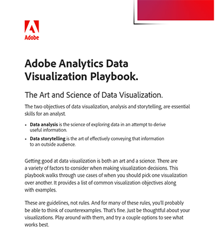

# Adobe Analytics Data Visualization Playbook

Data visualization is both an art and a science, requiring careful consideration of various factors. To help navigate some of these decisions, we have put together the Data Visualization Playbook. 

[Download](assets/adobe-analytics-data-visualization-playbook.pdf) the Adobe Analytics Visualization Playbook

Whether you're tackling common business questions or diving into complex analyses, this comprehensive playbook looks at a range of use-cases demonstrating when and how to use different visualizations effectively.

## Author

This document was created by David Geist,
data and insights business consultant at Adobe.
