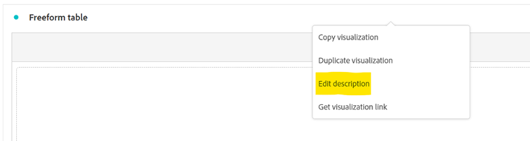
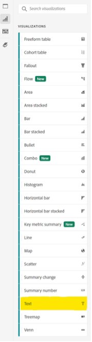
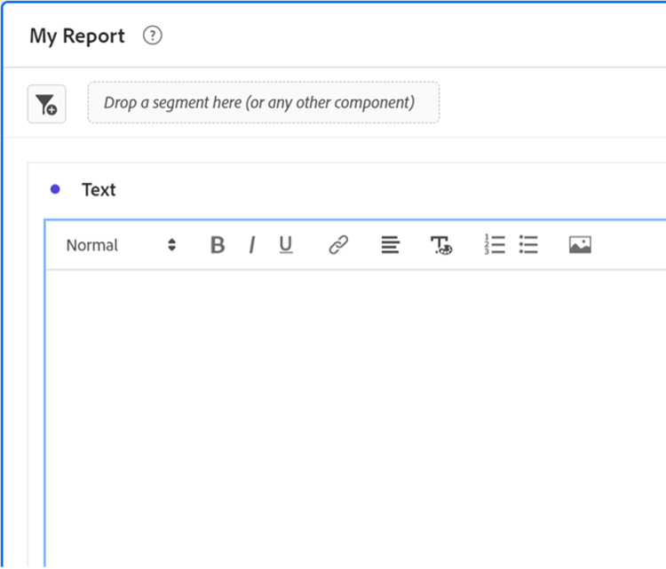
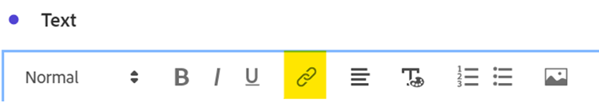
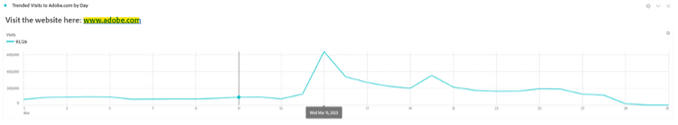
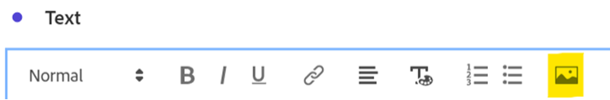
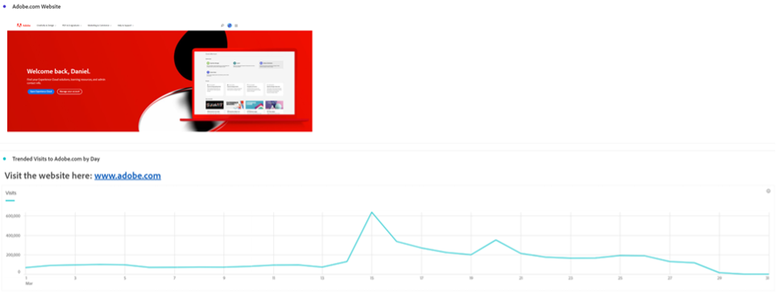

# More than words - Using text visualizations and descriptions in Analysis Workspace

As an Adobe Analytics Analysis Workspace user, it's natural that your focus will often go to your data and data visualizations - anyone can type a summary, right? However, overlooking features in Analysis Workspace like the Text visualization or the visualization descriptions may mean missing a valuable opportunity to combine your insights with valuable text, images, gifs, and links. By giving references and more context to inform your users about what your data means, it can make it more effective and impactful.

First, let's make sure you know where you can find these features:

- To add or modify the Description of a visualization, simply right-click the top area of the element and select the "Edit Description" link:

    

- To add a separate Text panel, click on the Visualizations menu of your left navigation bar:

    

While this guide shows an example using one of these two methods, you can make similar additions in both descriptions and Text visualizations. You can also adjust font pitch, alignment, color, and build bulleted or numbered lists:

Let's get started. One very helpful piece of context to add to any Analysis Workspace project is a hyperlink - this can include linking to the URL of the page detailed in the report, links to other Analysis Workspace projects, external report context pages, or anything else that may be helpful to have handy while viewing your report. This feature is accessible by selecting any portion of your text and selecting the "link" icon:

The result is that anyone viewing the Analysis Workspace project can reach any page accessible to them online or in your organization's intranet with a single click: 

Now if you prefer to bring the content directly into your report, you can use an Image link to place the content alongside your data:

You can add an image accessible on any public URL to your report, as long as the URL is in *https* format and is formatted as a .png, .jpeg, .jpg, or .gif - while this can sound restrictive, any online tools used to share images or GIFs like imgur or GIPHY can provide a quick method to upload Workspace-accessible files using a Share Link. 

The result? You can show the webpage page your data is referencing directly in your project:

You can also use GIFs in your projects to include moving imagery like a site walkthrough, ideal path through your site or a task on your app, or simply just show your team how ***mind-blowing*** your reports have now become:

## Author

This document was written by:

**Dan Cummings**, Sr. Product Engineering Analytics Manager at McDonald's Corporation

Adobe Analytics Champion
