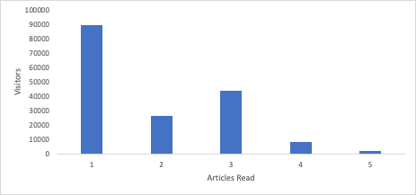
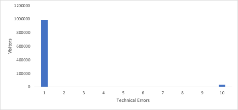
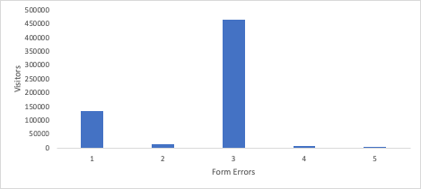

# Unlocking insights with histograms: beyond averages in [!DNL Analytics]

_Discover the impact of histograms in analytics for insights beyond averages. Histograms reveal data patterns in customer behavior, visitor engagement, technical performance, and form errors, enabling deeper insights and informed decisions in [!DNL Adobe] Workspace._

Let's jump right in. You should be using [histograms](https://experienceleague.adobe.com/docs/analytics/analyze/analysis-workspace/visualizations/histogram.html). I'm going to explain why, but I want to answer your first question: What in the world is a histogram? I get it. Most of the time, when you see a bunch of bars going up, you might think it's a bar graph. Yes, histograms do look similar, but I assure you, they are different. A bar chart compares things, whereas a histogram shows you how often a variable occurred. Take a look. Here's a bar chart:

We've got six models, and we can compare the revenue for each model. We see that the Johannesburg model has the most revenue, while Berlin has the least.

Now, let's look at a histogram:

At the bottom of the x-axis, we have the number of units purchased by each customer. The first bar represents how often a customer bought one unit, the second bar shows how many customers bought two units, and so on, up to customers buying ten or more units.

So, how is this useful? Well, we see most people only buy one unit. It keeps declining until we get to five units. Then it declines again until we get to ten units. This points to the fact that customers really like buying in multiples of five, and maybe we should offer special pricing or packaging to take advantage of that. But there are certainly a lot of other uses as well.

## Understanding Visitor Engagement

If your site or app relies on repeat traffic, you want to know how many visitors are coming back and how often. One of the simplest histograms you can use is to find out how many visitors are returning more than once. As you track that histogram over time, you can see your progress, as hopefully the bars on the right get taller and the ones on the left get shorter.

Maybe you want to keep people on the site, reading articles. A histogram showing how many visitors read different numbers of articles would give you insight into the level of engagement. Why is that helpful? Let's say you find most visitors read one article and leave, but some highly engaged visitors read three articles and leave. That's great information! Now you know that you should personalize the page on the first and third articles read with the goal of getting visitors to read one more article.

## Understanding Customer Behavior

The product owner for patient records at a hospital system asked me for some data. There were six regions to choose from to get your medical records. She wanted to know how many people were clicking on more than one. I created a histogram that showed how many visitors were clicking on 1, 2, 3, 4, 5, or 6 options. That might seem excessive, but over half of visitors were clicking on at least two options, and a full 3.2% of visitors were clicking on all six. With that histogram in front of her, she leapt into action, rearranged her roadmap, and simplified the options down to two. This made the patient's experience far simpler.

## Understanding Technical Performance

If you set up a histogram for how many visitors experience how many technical errors, you can gain a great understanding of how your site is performing technically. A lot of visitors experiencing a lot of technical errors is a sign to begin prioritizing those technical fixes.

## Understanding Form Performance

Error messages on a form are a different matter. Those are visitor errors, not errors on your part. But you could benefit from a histogram that shows you how many visitors are experiencing how many errors. If you see a histogram indicating many visitors are experiencing many errors, it might not be their fault. This would be a great indication that your form has poorly named fields, unclear instructions, or perhaps a design that hides mandatory fields.

## Why Not a Calculated Metric?

You may ask, how does this differ from just having a calculated metric? Hey, I looooove a good calculated metric. I think they're absolutely essential tools for understanding your site's performance. The issue for many of the use cases I've listed, though, is that an average can show you the size of the problem but obscure the scope of it. Let's go through how histograms give you additional information for some of the use cases above:

- Visitor Engagement - If you have an average number of stories read of 1.2, personalizing the first article is pretty evident. You'll miss that there's another large group that exits after reading the third article, which is what the histogram makes obvious.

    

- Technical Errors - If you saw an average of 8.7 errors per visitor, you'd know you had a problem. The histogram could show you that 97% of visitors experience one or fewer errors, but a handful of outliers are driving the average up. You might then decide that it's not worthwhile to dedicate a lot of time to improving the experience for that tiny group of outliers.

    

- Form Errors - If you have an average of 3.6 form error messages per visitor, that's an indicator of a problem. You might have the same outlier issue as the technical errors, but there's also insight to be gained from seeing a spike in the histogram at a particular number of errors. A huge spike at one error? This could either be a common problem that all these visitors experience or maybe they all got a different error once. A giant spike at three errors? Ah, now that's interesting. If that prompts an investigation that shows it's the same three errors, you've zeroed in on data that gives you an understanding of your visitors and helps you fix what's likely a group of interrelated problems.

    

As you can see, histograms not only have their own uses, but they also deepen the insight you gain from an average. They're an out-of-the-box visualization in [!DNL Adobe] [!DNL Analytics] and easy to create. Hopefully, these use cases are helpful to you or spark some inspiration. Happy visualizing!

## Author

This document was written by:

**Gitai Ben-Ammi**, Principal Consultant at Concentrix Catalyst 

[!DNL Adobe] [!DNL Analytics] Champion
