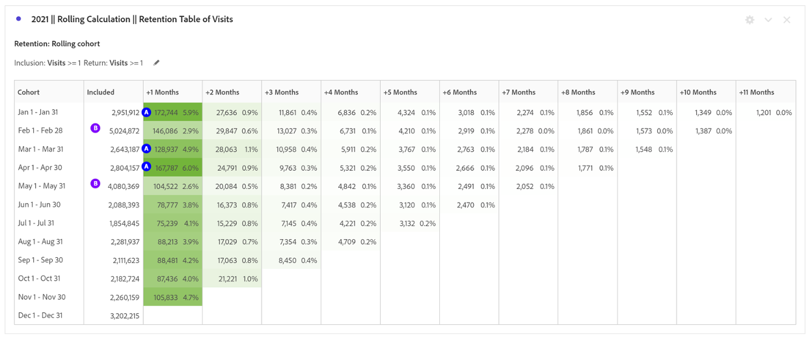
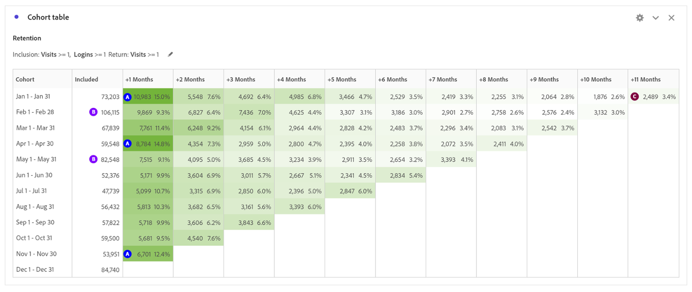
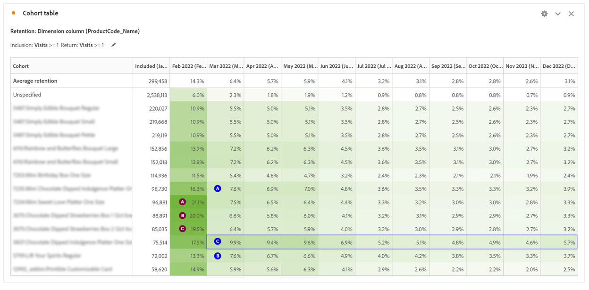

# Use Cohort Analysis to Understand Customer Behavior

To improve customer experience and revenue, businesses must understand customer behavior. Cohort analysis can help comprehend engagement and retention, leading to actions like improving account creation and creating campaigns for high-volume months.

Analyzing digital performance is crucial to understanding how customers interact with a business and what actions can be taken to improve their experience. In this blog post, we will explore how to use cohort analysis to better understand customer behavior. 

## Part 1: Comparing Digital Performance between First and Return Visits

### Setting the Stage

A client is looking to understand Digital performance over the last 2 years and is considering developing a loyalty program to drive digital performance. For starters, we can look at the current site mix between new and repeat users to understand how the two groups of visitors behave today.

Current Digital Performance

1. In 2022, 62% of orders came from first-time visits compared to 38% of orders from return visits (subject to cookies, multiple devices).
1. First-time visits convert at a slightly higher rate than return visits for both, 11.6% vs. 11.4%.
1. Compared to 2021, conversion rates declined across both segments.

## Part 2: Cohort Analysis - Visits Edible Arrangements Global Prod

To understand the stickiness of Digital channel and opportunity to drive repeat purchasers, the next question to answer is: What is the volume of visitors that are returning to the site every month in 2022?

### Introducing Cohort Analysis

Cohort analysis is a useful tool for understanding how cohorts engage with a brand over time. To start, we determined what questions to answer:

1. In a given year, what is the average retention period by month?
1. What volume of visitors to the site return every month in a given year?
1. What is the impact of logins on retention?
1. Are there specific products that drove higher retention?

How to set up the Cohort Table

1. Set Date Range to Jan to Dec 2022
1. **Inclusion criteria:** Visits
1. **Return criteria:** Visits
1. **Granularity:** Month
1. **Settings:** Rolling Calculation 
   \*\*Lets you calculate retention based on the previous column, not the included column. So, this means that a user is included in each of the months\*\*
1. **Segments:** you can select specific segments to drive this analysis further
   1. Specific Landing Pages
   1. Device Type
   1. Marketing Channels
   1. Etc. 

### Interpreting the results

**In 2022:**

1) Months with the highest retention rates +1 month include January, April and November
1) Months with the most volume include February and May
1) There are ~1,000 visitors that return to the site every month

**In 2021:**

1) Months with the highest retention rates +1 month include April, January and March
1) Months with the most volume include February and May

**Action items:**

Create a segment based on the ~1,000 Visitors and learn more about them:

- Where are they located?
- What products do they purchase throughout the year?
- What stores are they buying from?

Key months highlight opportunity to drive retention based on volume:

- Are there specific tactics that can drive additional stickiness during February and May to take advantage of volume?

Repeat analysis for Orders to understand Repeat Purchasers

- Are the highest +1 month retention rates for the same months? 
- Are the highest months of Visits the same for Orders?

## Part 3: Adding two metrics to Inclusion Criteria

### Understanding impact of Login

Since this client is looking to understand the value of a Loyalty program, the next step in the analysis included adding in the Login success event as an Inclusion metric to the Cohort.

Caveat: Cohort analysis cannot be used for calculated metrics (such as Conversion Rate) or non-integer metrics (such as Revenue). Only metrics that can be used in segments can be used in Cohort Analysis, and they can only be incremented by >1 at a time.

Is the site more likely to retain users that are logging in?

What would be the impact if we could get more users to login? Is that a stickier experience?

### Setting up the Cohort table

1. **Set Date Range:** to Jan to Dec 2022
1. **Inclusion criteria:** Visits + Login success event
1. **Return criteria:** Visits
1. **Granularity:** Month
1. **Settings:** Rolling Calculation 
   \*\*Lets you calculate retention based on the previous column, not the included column. So, this means that a user is included in each of the months\*\*

### Interpreting the Results

**In 2022:**

1) Months with the highest retention rates +1 month include January, April and November (same months as first cohort table)
1) Months with the most volume include February and May and December
1) There are ~2500 visitors that return every month \*\*more than double\*\*

**Action items:**

Investigate site user experience for getting users to create an account during Checkout

## Part 4: Custom Dimension Cohort

Custom Dimension Cohort: Create cohorts based on the selected dimension, rather than time-based cohorts (default). Many customers want to analyze their cohorts by something other than time and the new Custom Dimension Cohort feature provides you with the flexibility to build cohorts based on dimensions of their choosing. Use dimensions such as marketing channel, campaign, product, page, region, or any other dimension in [!DNL Adobe Analytics] to show how retention changes based on the different values of these dimensions. The

Custom Dimension Cohort segment definition applies the dimension item only as part of the inclusion period, not as part of the return definition.

After choosing the Custom Dimension Cohort option, you can drag and drop whichever dimension you want into the drop zone. This allows you to compare similar dimension items across the same time period. For example, you can compare performance of cities side by

side, products, campaigns, etc. It will return your top 14-dimension items. However, you can use a filter (access it by hovering on the right of the dimension that was dragged on) to display only desired dimension items. A Custom Dimension Cohort cannot be used with the Latency Table feature.

### What Products are driving the site stickiness?

Custom Dimension Cohort table highlights products that are driving higher retention rates than the average.  This table helps identify your top products to drive internal and external marketing campaigns featuring top attention-worthy products.

**In Feb:** 3 products standout with higher retention rates

1) Product 1
1) Product 2
1) Product 3

**In Mar:**

1) Product 1
1) Product 2
1) Product 3 -- frequently outperforms with a higher retention rate compared to average retention.

## Conclusion

Cohort analysis and Custom Dimension Cohort are powerful tools for understanding customer behavior and improving digital performance. By analyzing retention rates, login rates, and the impact of specific products, businesses can make data-driven decisions to improve the customer experience and drive growth.  

## Author

This document was written by:

**Jennifer Yacenda**, Senior Director at Marriott

[!DNL Adobe Analytics] Champion
