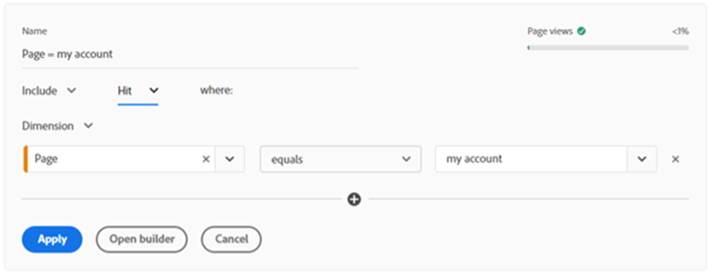
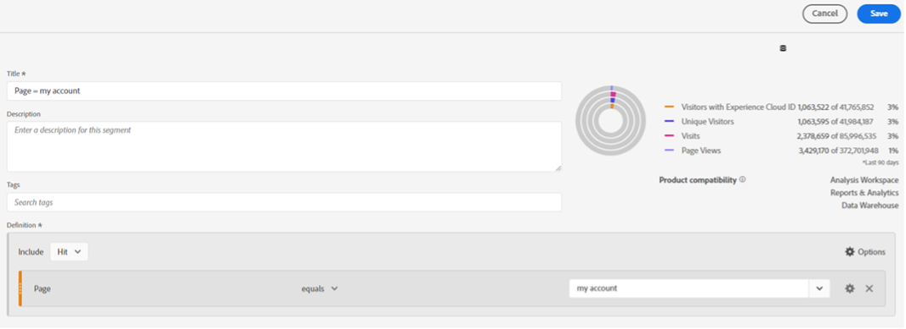
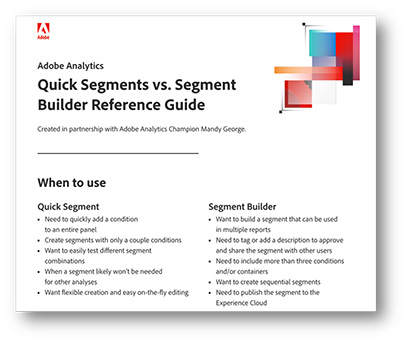

# Differences between the segment builder and quick segments in Analysis Workspace

Segments can be one of the most powerful tools in your data analysis toolkit. Learn the differences between using the segment builder and quick segments in Analysis Workspace for efficiency.

>[!TIP]
>
> Click the image at the bottom of the page to download a helpful reminder on when to use each tool in Analysis Workspace.

Segments can be one of the most powerful tools in your data analysis toolkit. When you want to look at specific groups of traffic, site sections, or customer journeys, using segments can be a great way to focus your analysis on a particular subset of traffic to your site. Coming from a retail environment, some of the most useful segments I've made are for different types of customer groups, for example new vs. existing customers, customers signed into an account vs. guests, and so on. But you can also make them for different site sections, customers that perform specific actions, or anything else you can think of!

**There are two main ways to build segments:**

* Using the segment builder in the components menu 
* Using the quick segments at the top of a panel

If you build your segment using the segment builder, you can save it to reuse in other projects. This is a great way to be able to focus on specific groups of customers, for example, people who visit certain sections of the site and then make a purchase. On the other hand, if you're doing an exploratory analysis and want to test different segment settings, the quick segment builder can be a great help. Let's look at some of the main benefits of each method.
 
## Quick Segments

At the top of each panel, you can click the quick segment icon (a funnel with the + symbol) to open the builder. This will let you build a segment at any level (hit, visit, or visitor) with up to three conditions. Similar to the main segment builder, this gives you an indication on the right-hand side that notes if the segment is returning data and % of overall traffic population included in the segment, although this is a more simplified version than the full segment volume view displayed in the segment builder. When adding more than one condition, you can use the 'and' and 'or' operators. Unfortunately, there is no 'then' option for quick segments, so if you need sequential segments you will need to use the full segment builder. There is also  a limit of one container in a quick segment. Since it really is meant to be used for basic segments that can be made and edited quickly. Once a quick segment is applied to a panel or saved, it can no longer be edited within the panel.

When doing an exploratory analysis, and you want to test different types of segments to see how different customer groups react or how different categories perform – using quick segments is a lot faster than using the segment builder. Additionally, these segments are only available in the project they were created in, so if it turns out to not provide the results you want, you don't need to worry about deleting the saved segment from the master list. If after testing out the segments you realize that it will be useful in other projects, you can always click the 'open builder' button to open the segment in the full segment builder to save it as a regular segment. Once you do that, however, you will no longer be able to edit it in the quick segment builder.

 
## Segment Builder

The segment builder can be accessed by clicking the + symbol above the list of segments in the left-hand components' menu, or from clicking the components dropdown and selecting 'Create Segment…' Unlike the quick segments, this has all the options available to you. For adding multiple conditions, you can create sequential segments using the 'then' operator. Sequential segments also allow you to use 'logic group' as your level (instead of hit, visit, or visitor). The segment builder will also allow you to add in a description to the segments, which can add context about who built the segment or what type of data it has been built to filter, or even simply add 'tags' to the segment for organizational purposes both of which are not possible within the quick segment builder.

Using the segment builder is essential when your segment is going to have more than 3 conditions, if you need to use containers, or want sequential segments. The full segment builder has a lot more options to make more intricate segments, which can help you break down different customer types, categories, customer journeys, and so on. Once these segments have been created and saved, they are added to the master list of segments, meaning they can be tagged, approved, shared, used in multiple reports, and published to the Experience Cloud. Publishing in the Experience Cloud allows you to utilize the segment in other Adobe products, such as in Adobe Target for personalization targeting. Segments built in the segment builder can't be edited in the quick segments panel, you will need to open the segment builder to make any changes to them. Fortunately, the preview visualization to the right provides a more detailed analysis of the traffic the segment would bring in for the last 90 days, meaning it is easier to be sure the segment is bringing in what you want it to before saving. 

## Use Cases

In different industries, your uses for building custom segments might differ. Working for the ecommerce division of a large retailer, we often perform exploratory analyses to determine what paths customers are taking to purchase. When we see spikes or drops in actions such as adding products to carts or placing orders, this is where using the quick segments can come in handy. During an analysis I can quickly create a segment for a specific type of customer or for a particular action/link that they click on. By not having to open the segment builder and saving each segment, I can add the conditions quickly, and then remove them just as quickly. This saves a lot of time when trying to explain why we see a change on our site.
 
Alternatively, there are times that the segment builder has been my go-to. Not every customer is the same, and often we want to look at specific types of customers that are identified by actions or paths that they take. By using the segment builder, we can add multiple conditions to identify the different types of customers and save the segments so that they can be shared and used by multiple analysts. It is important to have these types of segments be consistent across reports, so having one built out that everyone can use is better than each person building their own version, as results may differ.

Overall, both the quick segments and the segment builder are excellent tools to use in your analysis. They each have their purposes, benefits, and drawbacks. Be sure to check out our handy downloadable tips and tricks sheet below for a quick reference guide. 

## Author

This document was written by:

**Mandy George**, Digital Analyst III at Best Buy Canada

Adobe Analytics Champion

## Download

