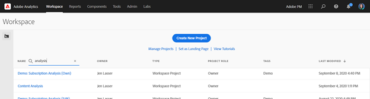
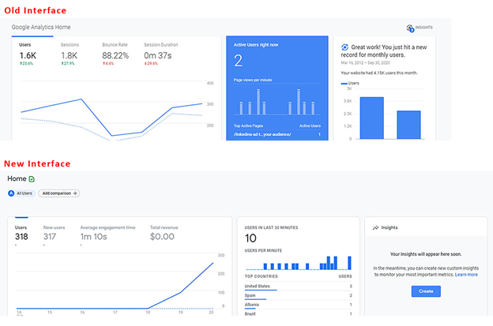
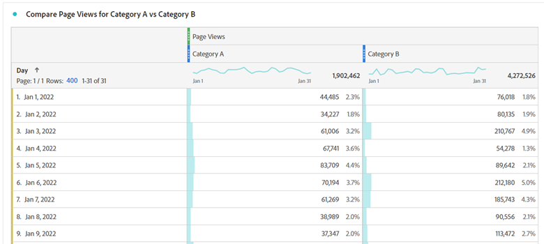
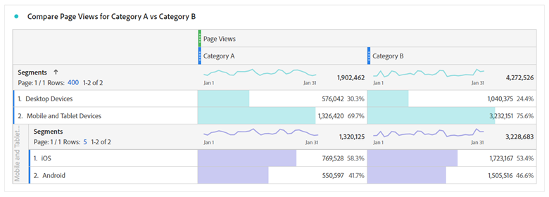
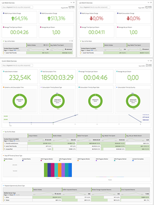
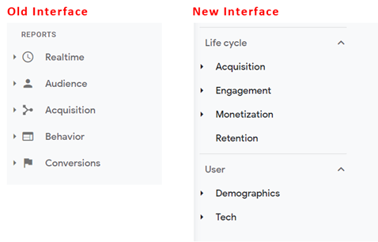

# Comprehensive guide for transitioning to Adobe Analytics from Google Analytics{#comprehensive-guide-for-transitioning-to-Adobe-Analytics}

## 1. Introduction

One of the biggest challenges in transitioning between any tools is learning where to find equivalent functionality and learning how to use it efficiently. This discussion is part of a larger guide to help users transition to Adobe Analytics (either as a new user, or one coming from Google Analytics) easier. An in-depth comparison to GA; as the most likely comparative tool that most users have familiarity with; is provided to help users correlate existing knowledge to the new toolset. When there is no substitute for practice, this helps get you started and reduce frustrations you may encounter during this time.

We should have a quick terminology comparison:

| **Description** | **Adobe Analytics** | **Google Analytics** |
|--------------------------------------------------------------------------------------------------------------------------------|---------------------|----------------------|
| An event metric that represents a page (or screen on an app) has been viewed | Page View| Pageview |
| A metric that represents a group of interactions on your website or app that take place in the same time frame | Visit | Session |
| A metric that defines an identified device (based on multiple criteria including cookies and other behavior patterns to stitch user information) | Unique Visitor | User |

## 2. The Interfaces

When people compare Adobe Analytics and Google Analytics, they comment that Adobe's interface is daunting at first. This is true, but it's also; believe it or not; a strength, not a weakness. Adobe provides a wide range of tools and flexibilities in your data visualization, allowing you much more freedom to build what you need.

Let's start by looking at the "in-site" reporting.

### 2.1. In-Site Reporting

#### 2.1.1. Home Screen

Both Adobe Analytics and Google Analytics provide a way to customize the first view a user sees when they log in.

##### 2.1.1.1. Workspace / Custom Set Home Screen (Adobe Analytics)

Adobe Analytics doesn't presume to create a pre-built report for all users to see on login. The default home page takes the user to the Workspace landing screen which shows each user all the workspace reports that they created or were shared with them. Also, each user can set any of these reports as their home screen if they so choose.

There are more details below regarding workspace later on in this guide. See Section 2.1.2.1

>[!TIP]
>
>Create / Share some standard reports for your organization so that they have a starting point to see information without having to dive into building their own reports right away.

##### 2.1.1.2. Home Screen Insights (Google Analytics)

* Google Analytics Home Screen has some pre-built visualizations for you. These cover things like:
* Users, Sessions, Bounce Rate, and Session Duration in the last seven days
* Users by Time of Day in the last 30 days
* Current Users Right Now, and Top Active Pages
* Traffic Channel, Source/Medium, and Referrals in the last seven days
* Sessions by Country in the last seven days
* Top Pages for the Last seven Days
* Active Users trend for the last 30 days
* and more

GA4 users have more options to customize and add their own reports to the Home Screen.

This is probably the one thing that you miss most in Adobe Analytics. There isn't a home screen pre-built for you. However, you can easily set up a custom Workspace to replicate what you need from the above list and set it as your landing screen. There's more on this topic later (or see Section 2.1.2.1 Adobe Workspace).

#### 2.1.2. In-Site Report Builders

In addition to the Simple Reports that the analytics tools provided, each tool also provides more powerful tools with which to build out your own custom reports.

##### 2.1.2.1. Adobe Analytics Workspace

This is the powerhouse of Adobe Analytics, since its introduction in 2017 it has become the go to place for Analytics analysis, and the primary reason why the Reports section is soon-to-be sunset. 

This tool allows you to build out reports with almost complete freedom.

The report can be broken into Panels and those panels can contain any number of visualizations. Panels can be set to common information, such as date range and common segment filters.

Both the panels and the visualizations inside them can be resized and dragged around to show items side by side, or stacked. So if you wanted to compare two different suites of data side by side, you could create panels that split 50/50 down the middle showing the two sites side by side for easy comparison.

There are a multitude of visualizations available to users:

* Freeform Table
* Cohort Table
* Fallout
* Flow
* Graphs
  * Area (Stacked and Unstacked)
  * Line
  * Scatter
  * Bar (Stacked and Unstacked)
  * Bullet
  * Donut
  * Histogram
  * Horizontal Bar (Stacked and Unstacked)
* Map
* Summary Blocks
  * Summary Change
  * Summary Text
  * Text (free text field to enter extra information to give context)
* Venn

Each panel and visualization can be titled and have a description applied to it to help give context to what the information is showing.
In Adobe, segments (essentially filters for data) apply retroactively, and these can be pulled into columns of your freeform tables to compare data side by side. For instance, if a user wanted to compare two different categories on their site for traffic; they could create a segment for "Category A" and a different segment for "Category B".

Freeform tables allow for multiple columns and segmentation as is needed to visualize the data the way you want.

If you don't want to see a breakdown by date, simply drag and drop another dimension or segment there to see the data in a different way. For example, use segments for Device Type, and then add a breakdown by operating system for your Mobile/Tablet users:

Workspace allows your creativity to fly, you aren't limited to "standard" breakdowns. You can build out the visualizations that you need to deep dive into the comparisons you need to run.

>[!TIP]
>
>Don't be afraid to play and explore. There are so many ways to think outside the box. In addition, validate what you have built is showing what you think. Experience helps!

You can create on-the-fly calculated metrics or segments that live only inside the report to prevent flooding your segment and calculations repository. This allows you to create focused items that are needed for specific reports without confusing your organization with things that aren't usable in other contexts.

This discussion is just an introduction to this tool, there are other comprehensive guides to get you started. Once you review these guides, you make comprehensive reports such as the following:

Workspaces don't auto-save, so it's easier to do a one-time, ad-hoc report without clogging up your report repository.

Another powerful feature of workspaces is the ability to apply interactive modifiers to your reports in the form of drop-downs. These drop-downs don't work on exported CSV or PDF files of your reports. However, in the live report, they allow you to update all the visualizations in a panel to show the same report under different conditions. Multiple drop-downs can be used, and provided the options aren't mutually exclusive, the selected items stack to allow for a clean way to present information.

>[!IMPORTANT]
>
>To read more about using drop-downs  and freeform breakdowns see <https://experienceleaguecommunities.adobe.com/t5/adobe-analytics-discussions/the-power-of-dropdown-filters-and-dimension-breakdowns-in-adobe/td-p/434680> 

##### 2.1.2.2. Google Analytics: Dashboards, Custom Reports, and Saved Reports

Google has a few tools for creating reports within the interface, but they still follow the same display and limitations of the reports section. 

Now, for those versed in Google Analytics as you read this, you might be saying, "well wait a second, what about Google Data Studio, isn't that a better equivalent to Adobe's Workspace?" Yes, but Data Studio isn't technically a part of the Analytics tool, and it allows for connections to different data sources. This tool is covered later in the "Extended Report Access" section, specifically Section 2.2.3.

Google Dashboards and Custom Reports allow you to pull multiple visualizations together into one report, but unlike Workspace, you are still locked into simple correlations and what data can be placed into what columns. 

In Custom Reports, one of the biggest challenges is when you create a filter, it applies to all tabs of the report. There isn't a way to compare two different filters within the same report.

For surface comparisons, it does the job. These are all similar to the Adobe Legacy Dashboards, Custom Reports, and Bookmarks. Basic tools provided to support your needs, that reside within the report suite.

#### 2.1.3. Reports

Both Google and Adobe have some navigable reports that are per-built tables and basic timeline graphs based around a dimension.

##### 2.1.3.1. Adobe Analytics Reports

Adobe Analytics also has a Reports section, though this is being phased out in favor of Analysis Workspace. In fact, end-of-life has been announced for this interface, since Workspace is a more powerful tool. Most of these tables can be built and modified with more ease. Adobe's sections are far more broken out, and this can be daunting:

With most of the above being accessible via Workspaces, I give a brief overview of these sections and how they relate to Google Analytics, and highlight the reports here that are still relevant.

Site Metrics is what you would expect, this covers the standard metrics (page views, unique visitors, visits, and custom events that you have set up). This is similar to the Behavior report GA, but also includes some of what you would find in Audience (since Adobe doesn't split up the metric types). 

In here, you find "Bot" Reports. Traffic from bots is excluded from all your standard reports, however, there are two reports that provide insight into what is happening and which bots are coming to your site. This is especially good if you set up custom Bot Rules to exclude known spammer bots that frequently hit your site. You can get some insight into what those bots are doing without your main reports being flooded but that traffic. Bot reports are currently unavailable through Workspace (but new reporting capabilities coming soon allows users to get this information there as well).

Site Content is a grouping of Adobe standard dimensions: Page Name, Site Sections, Hierarchies, Servers and more. All of these dimensions are available in Workspace.

Mobile is a grouping of mobile device-specific data, including devices, device types, and more. These are available in Workspace.

Paths are not available in Workspace. Workspace has a Flow diagram where you can see the In and Out flows for a single page/value. In contrast, Paths allow you to see the most common paths used in your website. By default, Pages is the first path report that is set up for you. However, you can turn this on for custom props such as a "Page Type" value. You could look at pathing within page types. The other thing that I personally like about Paths is the simple way the information is presented… The flow diagram in workspace (depending on how much you are trying to look at) can get overwhelming. I recommend trying both out… they each have a use and value depending on what you are trying to achieve. It should be noted that any dimension can be used in Flows, whereas Pathing must be set up on a Prop in the Admin panel.

Traffic Sources, Campaigns, and Marketing Channels reports are all similar to the Acquisition report at Google's product. Traffic Sources focuses on Actual Referrers, Campaigns Focuses on your Campaign Codes, and Marketing Channels also focuses on Campaign Codes, but also applies extra logic as determined by you on how to process the information. Adobe provides more freedom on how to set up your rules. In contrast, Google does numerous things for you, and this is a shift in thinking. By default, Google's attribution for Campaign Codes is six months. Adobe's attribution is set to one week by default. This can be changed in your admin settings, but in Workspace you can actually apply custom attribution on top of any dimension giving you much more "on-the-fly" flexibility.

Visitor Retention and Visitor Profile reports are similar to the Audience reports in Google Analytics. Retention is focused more on the return frequency, while Visitor Profile is focused more on the Geography and Technology of the users. 

Custom Conversion and Custom Traffic reports are both custom dimension reports. Conversions are eVars. You can set a custom expiration to the value such as hit, visit, month, and year. This value remains in persistence for a user for the configured time frame unless overwritten. Traffic variables are props. You can also set these up for Pathing Reports or as list items that break apart multiple values based on a delimiter of your choice.

Media is for things like Videos or Audio files where you have set up special media tracking.

Custom Reports is a section where a user can customize the columns and breakdowns that they have created within the reports interface and save it as a custom report. However, as mentioned above, since Workspace allows for so much more powerful breakdowns and correlations, anything customized should be made there. This was a good solution back before Workspace existed.

The Bookmarks section is similar to Custom Reports, where frequently used reports could be bookmarked within the reports interface so that they could be found easier.

Dashboard was a legacy product that allowed people to combine reportlets of data together into one visualization. However, the functionality in Workspace (Section 2.1.2.1) is so much easier to work with, that this only exists as an access point to legacy reports that should be rebuilt before this feature is sunset.

Targets allow people to create a report based on a target within a certain timeframe. Teams monitor campaigns to see if they are on track to hit their traffic targets.

All the reports here allowed for multiple metric columns and dimension breakdowns. However, the simplicity of the visualizations and some of the logic behind what elements could be correlated could be frustrating at times.

##### 2.1.3.2. Google Analytics Reports

Google Analytics splits these reports into the following sections: Realtime, Audience, Acquisition, Behavior, and Conversations (in GA3) and into Lifecycle (with the subsections: Acquisition, Engagement, Monetization, Retention) and User (with the subsections: Demographics and Tech).

You can make some minor tweaks to these visualizations, add a secondary dimension breakdown, change the visualization, create a filter on the data, and more. You can save your customizations as a Saved Report.

These provide quick and easy insights to your data. However, you can't compare things like Users to page views for a page in the same table, and you can't add more than one extra dimension to see additional data. 

These are good for quick analytical data, but if you really need to dig deep, they suffer from the limitations.

### 2.2. Extended Report Access

In addition to "In-Site Reporting", most tools offer extended functionality that allows you to take your analysis outside of the tools and build something a little more customized.

#### 2.2.1. Adobe Analytics Report Builder (Microsoft&reg; Excel Extension)

Workspace is a great tool, but sometimes you need to get your data into a customized spreadsheet, possibly so that you can stitch together multiple sources of data. This is where Report Builder comes into play.

Report Builder is a plug-in for Microsoft&reg; Excel that allows you to create connections to your Adobe Analytics data to pull in tabular data that you can manipulate within Excel. Generally to use this efficiently you would pull the data into some raw data tabs, then use excel cell references to pull data from these tabs into a single consolidated report, then create graphs and visualizations.

>[!NOTE]
>
>Report Builder has a special permission that needs to be applied to your users to access this plugin. This should be granted to users who have learned how to use the tool properly.

#### 2.2.2. Adobe Analytics API Connection

If you need Adobe Analytics data to be digested by something other than Excel, and you want the processed data including the bot rule exclusions, use Adobe's API to pull the data directly. Then, process the data using a script or add it to a database for use with another system.

It should be noted that the API still pulls in correlation data applying the breakdowns and segments as are specified in the pull request. 

Adobe's Workspace (Section 2.1.2.1) uses the API to build the reports, and if you enable debug mode in Workspace, it shows you the exact API calls used. This is a quick way to build out your API calls. By using Workspace to build and validate the data you want to pull, you then use those API calls to get the data out to your own processing.

#### 2.2.3. Google Analytics Data Studio

If you have been reading along, you already know from above that I mentioned Data Studio as being an equivalent to Adobe's Workspace. Data Studio allows you to pull in Google Analytics data, but also data from other sources. This is nice if you want to consolidate your analytics data with other collected data. However, with Google Analytics, the same type of visualization limitations are present. The way the rows and columns are formed is still limited. 

It's still a powerful tool, and I wouldn't dissuade people from using it in any way. My personal experience is that I find the rigid behavior quite limiting.

#### 2.2.4. Google Spreadsheet Extension

For my own uses, when I need to pull data in an extended manner from Google Analytics, my personal tool of choice is the Google Spreadsheet Extension. Even though I need to make multiple connections to my GA tables, I can reference the cells from the raw data and build out the reports I need. Then, I visualize them using the graphing capabilities of Google Spreadsheet.

## 3. Raw Data Exports

When you really need raw data, both Adobe and Google offer the capabilities to pull information in this manner.

### 3.1. Adobe Data Feed

In Section 2.2.2, I mentioned that the Adobe Analytics API pulled from "processed data". The Raw Data feed pulls data processed by the "Processing Rules" that have been set up in the admin panel, but this raw data includes all the data that is excluded everywhere else.

This means that all your Bot exclusions, internal IP filtered data, and other excluded data are in the raw data feeds. There are flags to identify this data, so if you build a data lake, the engineering team can create logic to process this data accordingly.

The raw data feeds can be customized to send all the columns of data, or only specific columns if you need a more focused feed.

The feeds can be sent directly to FTP, SFTP, or S3.

### 3.2. Google Big Query

Unfortunately, this is one Google tool I have not had any experience using. In theory, it should be similar to Adobe's Data Feed, allowing your engineering team to access raw data from your Google Analytics account.

However, rather than providing a full dump of raw data, it allows your engineers to access the data via SQL queries to pull targeted raw data or all columns of raw data. 

## 4. Conclusion

Like any system, practice is needed to get comfortable with the tool. Hopefully, this guide helps you get started or provides tips to improve your use of Adobe Analytics. 

I will, however, stress that I would recommend using both Adobe Analytics and Google Analytics in your implementation strategy (even if the Google Analytics is only the free version). This allows you to have a backup system to ensure you have data, as no system is infallible.

There are many resources available to you beyond this guide that can help improve your strategy:

* [Adobe Experience League](https://experienceleague.adobe.com/#home) - Contains tutorials, videos, documentation, and community forums
* [Adobe User Groups](https://analytics-augs.adobe.com/) - A hub of community-run events to help users connect with each other and improve their implementations.
* [Adobe Analytics User Groups YouTube Channel](https://www.youtube.com/channel/UCQOHnCs7KZgsuFHVzwboQuA) - Couldn't make an Adobe Analytics user group session? Rewatch previous user group sessions across the globe to learn more about how your peers are using the tool.
* [Measure Chat Slack channel](https://www.measure.chat/) - Connect with Adobe Analytics users across the world and share industry learnings, ask questions of your peers, and join measurement focused interest groups.
* and more!

## Author

This document was written by:

Jennifer Dungan, Optimization Manager Analytics at Torstar

Adobe Analytics Champion

