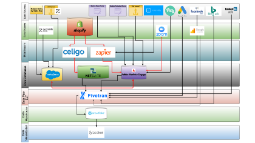
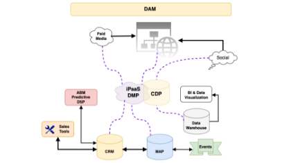

# Create a visual data flow diagram to understand your marketing tech stack

As an admin who takes over a [!DNL Marketo Engage] instance that has been live for years, it is like a mission impossible to audit and tidy up the instance efficiently. When Adobe [!DNL Marketo Champion] (2019), Kelly Jo Horton, stepped into a long-established instance, she tackled this challenge by [creating a diagram of "Lead and data sources"](https://nation.marketo.com/t5/employee-blogs/understand-your-marketing-technology-and-data-create-this/ba-p/296774){target="_blank"} to familiarize herself with the data universe. In this tutorial, you will learn how to create your own data flow diagram by building upon the examples shared by Kelly Jo Horton. Let's get to know your MarTech ecosystem!

## Why create an architecture diagram for your inherited instance? 

1. **Familiarize yourself with the marketing tech stack you inherited from a live instance.** All Marketing Operation Managers/Platform Operations Managers are encouraged to do this exercise when starting at a new company. This creation process enables admin users to see the full picture of the data and activities sent from external integrations to [!DNL Marketo Engage] and to easily troubleshoot the API errors. 
2. **Familiarize yourself with the key stakeholders who manage the external integrations.** A tip that Kelly Jo Horton uses to identify the stakeholders quickly is to reference the list of API users. 
   1. **Navigate to the 'Integration>LaunchPoint' tab in the 'Admin' section.** Learn more about how to navigate to the 'LaunchPoint' tab: [Create a Custom Service for Use with REST API](https://experienceleague.adobe.com/docs/marketo/using/product-docs/administration/additional-integrations/create-a-custom-service-for-use-with-rest-api.html){target="_blank"}.
   2. Find API usage statistics by API user in the Integration>Web Services tab in the API Call Information section. By clicking on the API call number, you can view the specific individual calls made by each user. 

## How to do this visual data flow diagram exercise 

### Step 1: Current State Diagram

Create a "Current State" diagram. Here is an example:

{align="center"}

### Step 2: Future State Diagram

Create a "Future State" diagram that can be used when presenting the technology and systems roadmap to non-technical stakeholders. Here is an example:  

{align="center"}

### Step 3: Technical Version

Create a technical version that shows details like the API username for each integration, a short description of the type of data being pushed to [!DNL Marketo Engage] or pulled from [!DNL Marketo Engage], and a detailed diagram of any middleware flows and triggers.  Here is an example:  

{align="center"}

## What's Next?

**Get Started with Examples:** 
Download one of the sample data flow diagrams to map out the current state of your marketing tech stack, person and data flow, or create a diagram for your data universe from scratch as you audit the instance:

<table style="table-layout:fixed">
   <tr>  
      <td style="border: 0;">
      

          <a href="./_assets/downloads/Current_Future_State_Lead_Data_Sources.zip">
            <strong>Current State and Future State</strong>
         </a>
      

      </td>
      <td style="border: 0;">
      

         <a href="./_assets/downloads/Detailed_Layers_by_Functional_Category_Stacked_Technologies.zip">
         <strong>Detailed Layers by Functional Category </strong>   
         </a>
      

      </td>
      <td style="border: 0;">
         

         <a href="./_assets/downloads/Lead_Data_Source.zip">
           <strong>Lead and Data Source Flow </strong>  
         </a>
         

       </td> 
       <td style="border: 0;">
         

         <a href="./_assets/downloads/Simple_World_Class_Stage_Stack.zip">
          <strong>Simplified Diagram</strong>  
         </a>
         

        </td>  
   </tr>
   <tr>
    <td style="border: 0;">
         

          
         </a>
      

      </td>
      <td style="border: 0;">
         

         
         

      </td>
       <td style="border: 0;">
         

            
         

      </td>
     <td style="border: 0;">
         

            
         

      </td>
</table>

These are a few tools that you can use: draw.io (Google Docs), Adobe XD, Figma, Gliffy (in Confluence)  

**What if there are architecture diagrams already?** New team members could have different perspectives. There is value in having new [!DNL Marketo Engage] admins do this exercise as part of their onboarding process and sharing it with others. 

## Authors

**Kelly Jo Horton**  
Adobe Marketo Champion (2019)
*Senior Client Partner at Etumos*

 {width="30%"}

**Amy Chiu**
*Adoption & Retention Marketing Manager, Adobe*

{width=30%}
